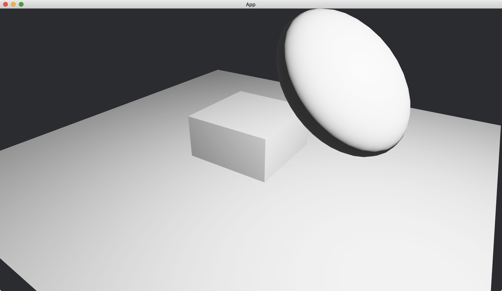

# 3D Transformation

Similar to 2D transformation, we can also use [Transform](https://docs.rs/bevy/latest/bevy/transform/components/struct.Transform.html) in 3D rendering.

In the following example, we make a sphere to scale 1.5 times along the x-axis, rotate roughly -45 degrees and translate 1 unit for both x- and y-axis.

```rust
commands.spawn(PbrBundle {
    mesh: meshes
        .add(
            UVSphere {
                radius: 0.5,
                ..default()
            }
            .into(),
        )
        .into(),
    transform: Transform {
        translation: (1., 1., 0.).into(),
        rotation: Quat::from_rotation_z(-0.78),
        scale: (1.5, 1., 1.).into(),
    },
    ..default()
});
```

In addition, we add a [Cube](https://docs.rs/bevy/latest/bevy/prelude/shape/struct.Cube.html) to show the position of the origin and add a [Plane](https://docs.rs/bevy/latest/bevy/prelude/shape/struct.Plane.html) to indicate the x-z plane.

We set our camera position to `(2, 2, 3)` and make it looking at the origin.

The full code is as follows:

```rust
use bevy::{
    app::{App, Startup},
    asset::Assets,
    core_pipeline::core_3d::Camera3dBundle,
    ecs::system::{Commands, ResMut},
    math::{Quat, Vec3},
    pbr::{PbrBundle, PointLightBundle, StandardMaterial},
    render::mesh::{
        shape::{Cube, Plane, UVSphere},
        Mesh,
    },
    transform::components::Transform,
    utils::default,
    DefaultPlugins,
};

fn main() {
    App::new()
        .add_plugins(DefaultPlugins)
        .add_systems(Startup, setup)
        .run();
}

fn setup(
    mut commands: Commands,
    mut meshes: ResMut<Assets<Mesh>>,
    mut materials: ResMut<Assets<StandardMaterial>>,
) {
    commands.spawn(Camera3dBundle {
        transform: Transform::from_xyz(2., 2., 3.).looking_at(Vec3::ZERO, Vec3::Y),
        ..default()
    });

    commands.spawn(PbrBundle {
        mesh: meshes
            .add(
                UVSphere {
                    radius: 0.5,
                    ..default()
                }
                .into(),
            )
            .into(),
        material: materials.add(StandardMaterial::default()).into(),
        transform: Transform {
            translation: (1., 1., 0.).into(),
            rotation: Quat::from_rotation_z(-0.78),
            scale: (1.5, 1., 1.).into(),
        },
        ..default()
    });

    commands.spawn(PbrBundle {
        mesh: meshes.add(Cube::new(1.).into()).into(),
        material: materials.add(StandardMaterial::default()).into(),
        ..default()
    });

    commands.spawn(PbrBundle {
        mesh: meshes.add(Plane::from_size(5.).into()).into(),
        material: materials.add(StandardMaterial::default()).into(),
        ..default()
    });

    commands.spawn(PointLightBundle {
        transform: Transform::from_xyz(2., 2., 1.),
        ..default()
    });
}
```

Result:



:arrow_right:  Next: [Hierarchical Transformation](./hierarchical_transformation.md)

:blue_book: Back: [Table of contents](./../README.md)
