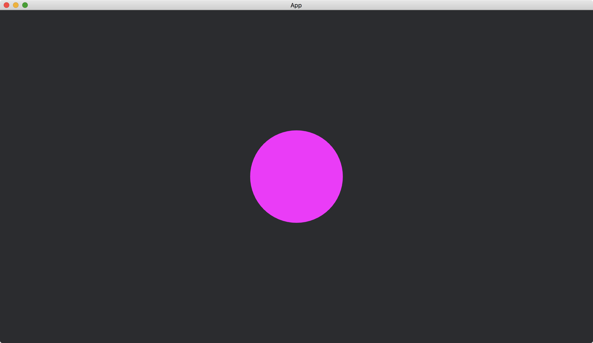

# A Timer Running Once

Sometimes, we need to have an event that occurs after some predefined time.
We can use the resource [Time](https://docs.rs/bevy/latest/bevy/time/struct.Time.html) introduced before and count the time by ourselves.
Or we can use a build-in utility [Timer](https://docs.rs/bevy/latest/bevy/time/struct.Timer.html) to help us.

In the following example, we create a [Circle](https://docs.rs/bevy/0.12.1/bevy/prelude/shape/struct.Circle.html), and the circle will become larger after three seconds.

We put a [Timer](https://docs.rs/bevy/latest/bevy/time/struct.Timer.html) in a custom resource named `MyTimer`.

```rust
#[derive(Resource)]
struct MyTimer(Timer);
```

The [Timer](https://docs.rs/bevy/latest/bevy/time/struct.Timer.html) is initialized when we insert the resource.

```rust
App::new().insert_resource(MyTimer(Timer::from_seconds(3., TimerMode::Once)))
```

We use the function [Timer::from_seconds](https://docs.rs/bevy/latest/bevy/time/struct.Timer.html#method.from_seconds) to set the time for the [Timer](https://docs.rs/bevy/latest/bevy/time/struct.Timer.html) to count.
We also specify [TimerMode::Once](https://docs.rs/bevy/latest/bevy/time/enum.TimerMode.html#variant.Once), so the event will be triggered at most once.

We check if the [Timer](https://docs.rs/bevy/latest/bevy/time/struct.Timer.html) satisfies its request in every frame update.

```rust
fn circle_scales(
    time: Res<Time>,
    mut my_timer: ResMut<MyTimer>,
    mut circles: Query<&mut Transform, With<Handle<ColorMaterial>>>,
) {
    let mut transform = circles.single_mut();

    if my_timer.0.tick(time.delta()).just_finished() {
        *transform = Transform::from_scale((2., 2., 1.).into());
    }
}
```

This is done by first updating the [Timer](https://docs.rs/bevy/latest/bevy/time/struct.Timer.html) through its [tick](https://docs.rs/bevy/latest/bevy/time/struct.Timer.html#method.tick) method.
We pass the [delta](https://docs.rs/bevy/latest/bevy/time/struct.Time.html#method.delta) of the engine time (i.e., the time difference from the last frame update) to the method.
Then we see if the [Timer](https://docs.rs/bevy/latest/bevy/time/struct.Timer.html) is [just_finished](https://docs.rs/bevy/latest/bevy/time/struct.Timer.html#method.just_finished) its counting.

The full code is as follows:

```rust
use bevy::{
    app::{App, Startup, Update},
    asset::{Assets, Handle},
    core_pipeline::core_2d::Camera2dBundle,
    ecs::{
        query::With,
        system::{Commands, Query, Res, ResMut, Resource},
    },
    render::mesh::{shape::Circle, Mesh},
    sprite::{ColorMaterial, ColorMesh2dBundle},
    time::{Time, Timer, TimerMode},
    transform::components::Transform,
    utils::default,
    DefaultPlugins,
};

#[derive(Resource)]
struct MyTimer(Timer);

fn main() {
    App::new()
        .add_plugins(DefaultPlugins)
        .insert_resource(MyTimer(Timer::from_seconds(3., TimerMode::Once)))
        .add_systems(Startup, setup)
        .add_systems(Update, circle_scales)
        .run();
}

fn setup(mut commands: Commands, mut meshes: ResMut<Assets<Mesh>>) {
    commands.spawn(Camera2dBundle::default());

    commands.spawn(ColorMesh2dBundle {
        mesh: meshes.add(Circle::new(50.).into()).into(),
        ..default()
    });
}

fn circle_scales(
    time: Res<Time>,
    mut my_timer: ResMut<MyTimer>,
    mut circles: Query<&mut Transform, With<Handle<ColorMaterial>>>,
) {
    let mut transform = circles.single_mut();

    if my_timer.0.tick(time.delta()).just_finished() {
        *transform = Transform::from_scale((2., 2., 1.).into());
    }
}
```

When the app started:


After three seconds:



:arrow_right:  Next: [A Timer Running Repeatedly](./a_timer_running_repeatedly.md)

:blue_book: Back: [Table of contents](./../README.md)
