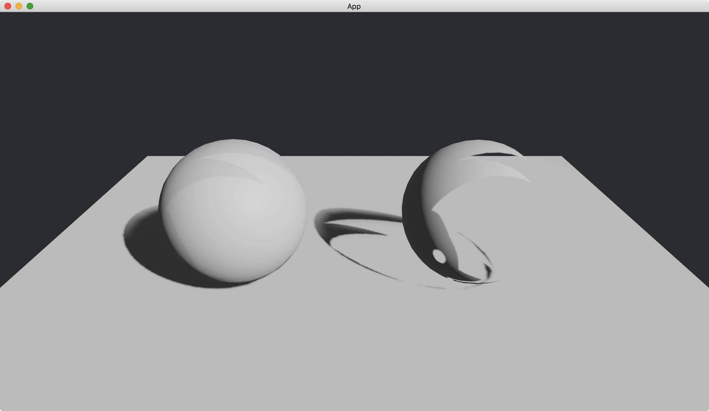

# Alpha Mode

We can make an object transparent based on its texture.
More precisely, we use the alpha channel of the texture picture to set transparencies of the object's parts.

Assume the `assets` directory has an image named [bevy_bird_dark.png](https://github.com/bevyengine/bevy/blob/main/assets/branding/bevy_bird_dark.png), which we will use as our texture.


Note that the background of [bevy_bird_dark.png](https://github.com/bevyengine/bevy/blob/main/assets/branding/bevy_bird_dark.png) is transparent.

We use [alpha_mode](https://docs.rs/bevy/latest/bevy/pbr/struct.StandardMaterial.html#structfield.alpha_mode) along with [base_color_texture](https://docs.rs/bevy/latest/bevy/pbr/struct.StandardMaterial.html#structfield.base_color_texture) in [StandardMaterial](https://docs.rs/bevy/latest/bevy/pbr/struct.StandardMaterial.html).

```rust
commands.spawn(PbrBundle {
    material: materials.add(StandardMaterial {
        base_color_texture: Some(asset_server.load("bevy_bird_dark.png")),
        alpha_mode: AlphaMode::Blend,
        ..default()
    }),
    ..default()
});
```

The [base_color_texture](https://docs.rs/bevy/latest/bevy/pbr/struct.StandardMaterial.html#structfield.base_color_texture) is set to [bevy_bird_dark.png](https://github.com/bevyengine/bevy/blob/main/assets/branding/bevy_bird_dark.png).
The value of [alpha_mode](https://docs.rs/bevy/latest/bevy/pbr/struct.StandardMaterial.html#structfield.alpha_mode) is an [AlphaMode](https://docs.rs/bevy/latest/bevy/pbr/enum.AlphaMode.html), which specifies how to make the object transparent.
We use [AlphaMode::Blend](https://docs.rs/bevy/latest/bevy/pbr/enum.AlphaMode.html#variant.Blend) here.

In the following example, we create two spheres.
The left sphere has no alpha mode and the right one has alpha mode `Blend`.

The full code is as follows:

```rust
use bevy::{
    app::{App, Startup},
    asset::{AssetServer, Assets},
    core_pipeline::core_3d::Camera3dBundle,
    ecs::system::{Commands, Res, ResMut},
    math::Vec3,
    pbr::{AlphaMode, DirectionalLight, DirectionalLightBundle, PbrBundle, StandardMaterial},
    render::mesh::{
        shape::{Plane, UVSphere},
        Mesh,
    },
    transform::components::Transform,
    utils::default,
    DefaultPlugins,
};

fn main() {
    App::new()
        .add_plugins(DefaultPlugins)
        .add_systems(Startup, setup)
        .run();
}

fn setup(
    mut commands: Commands,
    mut meshes: ResMut<Assets<Mesh>>,
    mut materials: ResMut<Assets<StandardMaterial>>,
    asset_server: Res<AssetServer>,
) {
    commands.spawn(Camera3dBundle {
        transform: Transform::from_xyz(0., 2., 3.).looking_at(Vec3::new(0., 0.5, 0.), Vec3::Y),
        ..default()
    });

    // left
    commands.spawn(PbrBundle {
        mesh: meshes.add(
            UVSphere {
                radius: 0.5,
                ..default()
            }
            .into(),
        ),
        material: materials.add(StandardMaterial {
            base_color_texture: Some(asset_server.load("bevy_bird_dark.png")),
            ..default()
        }),
        transform: Transform::from_xyz(-0.83, 0.5, 0.),
        ..default()
    });

    // right
    commands.spawn(PbrBundle {
        mesh: meshes.add(
            UVSphere {
                radius: 0.5,
                ..default()
            }
            .into(),
        ),
        material: materials.add(StandardMaterial {
            base_color_texture: Some(asset_server.load("bevy_bird_dark.png")),
            alpha_mode: AlphaMode::Blend,
            ..default()
        }),
        transform: Transform::from_xyz(0.83, 0.5, 0.),
        ..default()
    });

    commands.spawn(PbrBundle {
        mesh: meshes.add(Plane::from_size(5.).into()),
        material: materials.add(StandardMaterial::default()),
        ..default()
    });

    commands.spawn(DirectionalLightBundle {
        directional_light: DirectionalLight {
            illuminance: 20000.,
            shadows_enabled: true,
            ..default()
        },
        transform: Transform::default().looking_to(Vec3::new(-1., -1., -1.), Vec3::Y),
        ..default()
    });
}
```

Result:



We can see from the shadow of the right sphere that the sphere is indeed transparent.

<!-- :arrow_right:  Next:  -->

:blue_book: Back: [Table of contents](./../README.md)
