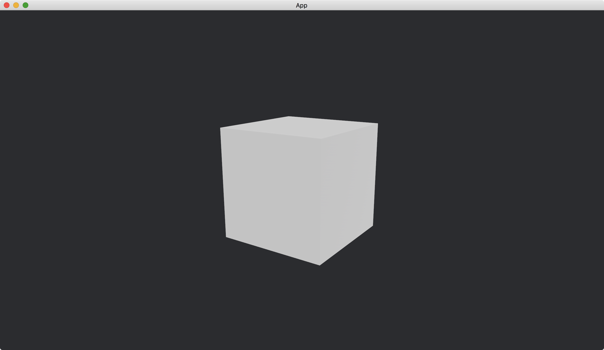

# Ambient Light

There are different kinds of light in [Bevy](https://bevyengine.org/).
Ambient light is one of them.
It is like sky light.
Objects receive the light equally no matter where they are in the 3D scene.

We use resource [AmbientLight](https://docs.rs/bevy/latest/bevy/pbr/struct.AmbientLight.html) to create an ambient light.

```rust
commands.insert_resource(AmbientLight {
    brightness: 2.,
    ..default()
});
```

We can change the [brightness](https://docs.rs/bevy/latest/bevy/pbr/struct.AmbientLight.html#structfield.brightness), which is how bright the light is.
The larger the brighter.

We place a [Cube](https://docs.rs/bevy/latest/bevy/prelude/shape/struct.Cube.html) at the origin, set our camera position to `(2, 1, 3)` and make it looking at the origin.

The full code is as follows:

```rust
use bevy::{
    app::{App, Startup},
    asset::Assets,
    core_pipeline::core_3d::Camera3dBundle,
    ecs::system::{Commands, ResMut},
    math::Vec3,
    pbr::{AmbientLight, PbrBundle, StandardMaterial},
    render::mesh::{shape::Cube, Mesh},
    transform::components::Transform,
    utils::default,
    DefaultPlugins,
};

fn main() {
    App::new()
        .add_plugins(DefaultPlugins)
        .add_systems(Startup, setup)
        .run();
}

fn setup(
    mut commands: Commands,
    mut meshes: ResMut<Assets<Mesh>>,
    mut materials: ResMut<Assets<StandardMaterial>>,
) {
    commands.spawn(Camera3dBundle {
        transform: Transform::from_xyz(2., 1., 3.).looking_at(Vec3::ZERO, Vec3::Y),
        ..default()
    });

    commands.spawn(PbrBundle {
        mesh: meshes.add(Cube::new(1.).into()).into(),
        material: materials.add(StandardMaterial::default()).into(),
        ..default()
    });

    commands.insert_resource(AmbientLight {
        brightness: 2.,
        ..default()
    });
}
```

Result:



:arrow_right:  Next: [Directional Light](./directional_light.md)

:blue_book: Back: [Table of contents](./../README.md)
