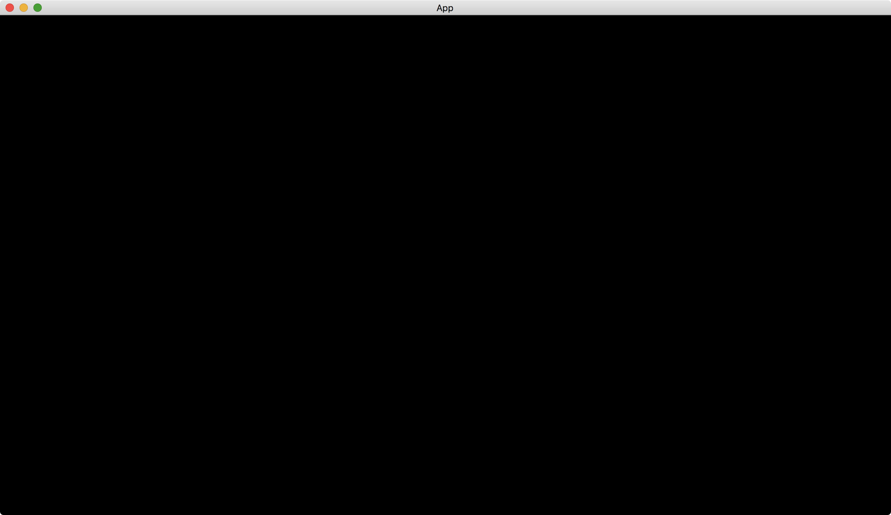

# An App With A Window

[Bevy](https://bevyengine.org/) has its default plugins, [DefaultPlugins](https://docs.rs/bevy/latest/bevy/struct.DefaultPlugins.html).
This set of plugins contains most functions that developers may need.
For example, the plugin set provides a default window.

To add the [DefaultPlugins](https://docs.rs/bevy/latest/bevy/struct.DefaultPlugins.html) into our app, we use the [add_plugins](https://docs.rs/bevy/latest/bevy/app/struct.App.html#method.add_plugins) method of [App](https://docs.rs/bevy/latest/bevy/app/struct.App.html).

```rust
use bevy::{app::App, DefaultPlugins};

fn main() {
    App::new().add_plugins(DefaultPlugins).run();
}
```

Result:



:arrow_right:  Next: [The Default Scheduler For Windowed App](./the_default_scheduler_for_windowed_app.md)

:blue_book: Back: [Table of contents](./../README.md)
