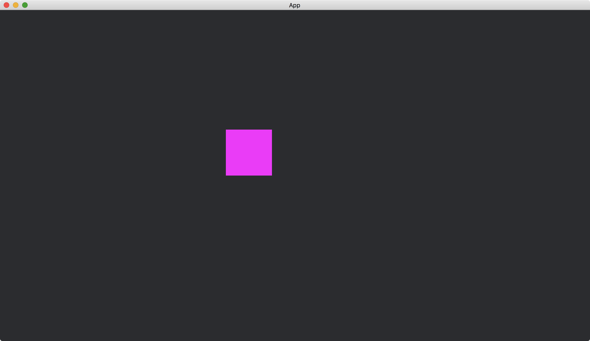
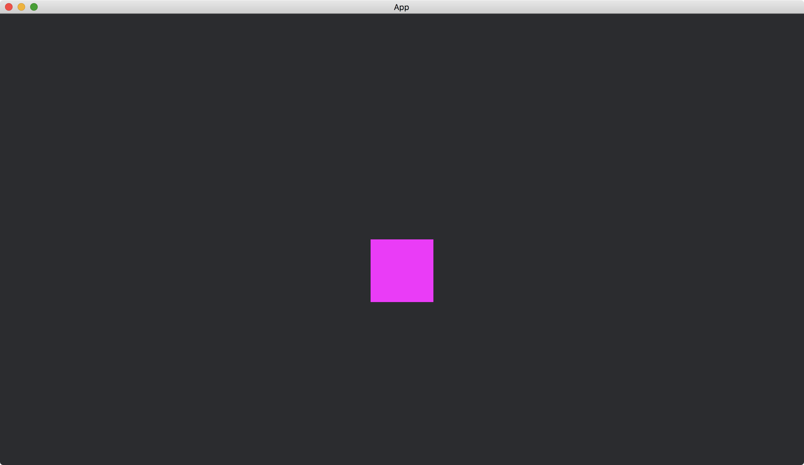
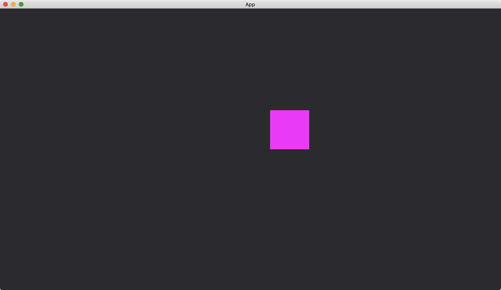

# Animated Transformation

We can define a curve and make a shape moves along the curve.
This is done by [AnimationClip](https://docs.rs/bevy/latest/bevy/animation/struct.AnimationClip.html) and [AnimationPlayer](https://docs.rs/bevy/latest/bevy/animation/struct.AnimationPlayer.html).
We define the curve in an [AnimationClip](https://docs.rs/bevy/latest/bevy/animation/struct.AnimationClip.html) and give it an identity of the shape.
The [AnimationClip](https://docs.rs/bevy/latest/bevy/animation/struct.AnimationClip.html) is then [play](https://docs.rs/bevy/latest/bevy/animation/struct.AnimationPlayer.html#method.play)ed by an [AnimationPlayer](https://docs.rs/bevy/latest/bevy/animation/struct.AnimationPlayer.html).

The [AnimationClip](https://docs.rs/bevy/latest/bevy/animation/struct.AnimationClip.html) receives an identity and a curve by its [add_curve_to_path](https://docs.rs/bevy/latest/bevy/animation/struct.AnimationClip.html#method.add_curve_to_path) method.

```rust
let mut animation = AnimationClip::default();

animation.add_curve_to_path(
    EntityPath {
        // ...
    },
    VariableCurve {
        // ...
    },
);
```

We pass the identity into [EntityPath](https://docs.rs/bevy/latest/bevy/animation/struct.EntityPath.html) and pass a description of the curve into [VariableCurve](https://docs.rs/bevy/latest/bevy/animation/struct.VariableCurve.html).

The identity is created by [Name](https://docs.rs/bevy/latest/bevy/core/struct.Name.html).

```rust
let rectangle_name = Name::new("rectangle");

// ...

animation.add_curve_to_path(
    EntityPath {
        parts: vec![rectangle_name.clone()],
    },
    // ...
);
```

The [VariableCurve](https://docs.rs/bevy/latest/bevy/animation/struct.VariableCurve.html) defines the curve.

```rust
animation.add_curve_to_path(
    // ...
    VariableCurve {
        keyframe_timestamps: vec![0., 1., 2., 3.],
        keyframes: Keyframes::Translation(vec![
            Vec3::new(-100., 50., 0.),
            Vec3::new(0., -50., 0.),
            Vec3::new(100., 50., 0.),
            Vec3::new(-100., 50., 0.),
        ]),
    },
);
```

The [keyframe_timestamps](https://docs.rs/bevy/latest/bevy/animation/struct.VariableCurve.html#structfield.keyframe_timestamps) in [VariableCurve](https://docs.rs/bevy/latest/bevy/animation/struct.VariableCurve.html) defines the moment (timestamps in seconds) that a transformation occurs.
The [keyframes](https://docs.rs/bevy/latest/bevy/animation/struct.VariableCurve.html#structfield.keyframes) in [VariableCurve](https://docs.rs/bevy/latest/bevy/animation/struct.VariableCurve.html) defines the actual transformation that happens at the corresponding timestamps.
Here, we use [Keyframes::Translation](https://docs.rs/bevy/latest/bevy/animation/enum.Keyframes.html#variant.Translation) in [keyframes](https://docs.rs/bevy/latest/bevy/animation/struct.VariableCurve.html#structfield.keyframes).
This describes the positions of the shape at the corresponding timestamps.
For example, at the beginning, the shape should be located at `Vec3::new(-100., 50., 0.)`, at the first second, it should be located at `Vec3::new(0., -50., 0.)`, and so on.

We use [AnimationPlayer](https://docs.rs/bevy/latest/bevy/animation/struct.AnimationPlayer.html) to change the shape according to the [AnimationClip](https://docs.rs/bevy/latest/bevy/animation/struct.AnimationClip.html).

```rust
fn setup(
    mut animations: ResMut<Assets<AnimationClip>>,
    // ...
) {
    // ...

    let mut player = AnimationPlayer::default();
    player.play(animations.add(animation)).repeat();

    // ...
}
```

We first [add](https://docs.rs/bevy/latest/bevy/asset/struct.Assets.html#method.add) the [AnimationClip](https://docs.rs/bevy/latest/bevy/animation/struct.AnimationClip.html) to the resource [Assets](https://docs.rs/bevy/latest/bevy/asset/struct.Assets.html)<[AnimationClip](https://docs.rs/bevy/latest/bevy/animation/struct.AnimationClip.html)>.
And then pass the [Handle](https://docs.rs/bevy/latest/bevy/asset/enum.Handle.html) of the [AnimationClip](https://docs.rs/bevy/latest/bevy/animation/struct.AnimationClip.html) to the method [play](https://docs.rs/bevy/latest/bevy/animation/struct.AnimationPlayer.html#method.play) of the [AnimationPlayer](https://docs.rs/bevy/latest/bevy/animation/struct.AnimationPlayer.html).
This tells the [AnimationPlayer](https://docs.rs/bevy/latest/bevy/animation/struct.AnimationPlayer.html) to start changing the corresponding shape.
We additionally call the method [repeat()](https://docs.rs/bevy/latest/bevy/animation/struct.AnimationPlayer.html#method.repeat) to allow the [AnimationClip](https://docs.rs/bevy/latest/bevy/animation/struct.AnimationClip.html) to be played repeatedly.

Finally, we make the app to [spawn](https://docs.rs/bevy/latest/bevy/ecs/system/struct.Commands.html#method.spawn) a rectangle.

```rust
commands.spawn((
    ColorMesh2dBundle {
        mesh: meshes.add(Quad::new((100., 100.).into()).into()).into(),
        ..default()
    },
    rectangle_name,
    player,
));
```

Be sure to [spawn](https://docs.rs/bevy/latest/bevy/ecs/system/struct.Commands.html#method.spawn) the [ColorMesh2dBundle](https://docs.rs/bevy/latest/bevy/sprite/type.ColorMesh2dBundle.html) along with the [Name](https://docs.rs/bevy/latest/bevy/core/struct.Name.html) (`rectangle_name` here) and the [AnimationPlayer](https://docs.rs/bevy/latest/bevy/animation/struct.AnimationPlayer.html).
So that the engine knows which shape the identity is for and which tool is able to change the shape.

The full code is as follows:

```rust
use bevy::{
    animation::{AnimationClip, AnimationPlayer, EntityPath, Keyframes, VariableCurve},
    app::{App, Startup},
    asset::Assets,
    core::Name,
    core_pipeline::core_2d::Camera2dBundle,
    ecs::system::{Commands, ResMut},
    math::Vec3,
    prelude::default,
    render::mesh::{shape::Quad, Mesh},
    sprite::ColorMesh2dBundle,
    DefaultPlugins,
};

fn main() {
    App::new()
        .add_plugins(DefaultPlugins)
        .add_systems(Startup, setup)
        .run();
}

fn setup(
    mut commands: Commands,
    mut meshes: ResMut<Assets<Mesh>>,
    mut animations: ResMut<Assets<AnimationClip>>,
) {
    commands.spawn(Camera2dBundle::default());

    let rectangle_name = Name::new("rectangle");
    let mut animation = AnimationClip::default();

    animation.add_curve_to_path(
        EntityPath {
            parts: vec![rectangle_name.clone()],
        },
        VariableCurve {
            keyframe_timestamps: vec![0., 1., 2., 3.],
            keyframes: Keyframes::Translation(vec![
                Vec3::new(-100., 50., 0.),
                Vec3::new(0., -50., 0.),
                Vec3::new(100., 50., 0.),
                Vec3::new(-100., 50., 0.),
            ]),
        },
    );

    let mut player = AnimationPlayer::default();
    player.play(animations.add(animation)).repeat();

    commands.spawn((
        ColorMesh2dBundle {
            mesh: meshes.add(Quad::new((100., 100.).into()).into()).into(),
            ..default()
        },
        rectangle_name,
        player,
    ));
}
```

When the app starts:



At the 1st second:



At the 2nd second:



For [keyframes](https://docs.rs/bevy/latest/bevy/animation/struct.VariableCurve.html#structfield.keyframes), in addition to [Keyframes::Translation](https://docs.rs/bevy/latest/bevy/animation/enum.Keyframes.html#variant.Translation), we can also use [Keyframes::Rotation](https://docs.rs/bevy/latest/bevy/animation/enum.Keyframes.html#variant.Rotation) and [Keyframes::Scale](https://docs.rs/bevy/latest/bevy/animation/enum.Keyframes.html#variant.Scale).

:arrow_right:  Next: [Keyboard Input](./keyboard_input.md)

:blue_book: Back: [Table of contents](./../README.md)
