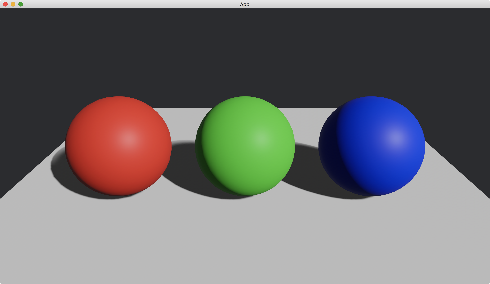

# Base Colors

To change the appearance of 3D objects, we use [StandardMaterial](https://docs.rs/bevy/latest/bevy/pbr/struct.StandardMaterial.html) in [PbrBundle](https://docs.rs/bevy/latest/bevy/pbr/type.PbrBundle.html).

We can change the color of 3D objects.
This is done by changing [base_color](https://docs.rs/bevy/latest/bevy/pbr/struct.StandardMaterial.html#structfield.base_color) of [StandardMaterial](https://docs.rs/bevy/latest/bevy/pbr/struct.StandardMaterial.html).

```rust
commands.spawn(PbrBundle {
    material: materials.add(StandardMaterial {
        base_color: Color::RED,
        ..default()
    }),
    ..default()
});
```

In the following example, we create three spheres.
The color of the left, middle and right sphere is red, green and blue respectively.

```rust
use bevy::{
    app::{App, Startup},
    asset::Assets,
    core_pipeline::core_3d::Camera3dBundle,
    ecs::system::{Commands, ResMut},
    math::Vec3,
    pbr::{DirectionalLight, DirectionalLightBundle, PbrBundle, StandardMaterial},
    render::{
        color::Color,
        mesh::{
            shape::{Plane, UVSphere},
            Mesh,
        },
    },
    transform::components::Transform,
    utils::default,
    DefaultPlugins,
};

fn main() {
    App::new()
        .add_plugins(DefaultPlugins)
        .add_systems(Startup, setup)
        .run();
}

fn setup(
    mut commands: Commands,
    mut meshes: ResMut<Assets<Mesh>>,
    mut materials: ResMut<Assets<StandardMaterial>>,
) {
    commands.spawn(Camera3dBundle {
        transform: Transform::from_xyz(0., 2., 3.).looking_at(Vec3::new(0., 0.5, 0.), Vec3::Y),
        ..default()
    });

    // left
    commands.spawn(PbrBundle {
        mesh: meshes.add(
            UVSphere {
                radius: 0.5,
                ..default()
            }
            .into(),
        ),
        material: materials.add(StandardMaterial {
            base_color: Color::RED,
            ..default()
        }),
        transform: Transform::from_xyz(-1.25, 0.5, 0.),
        ..default()
    });

    // middle
    commands.spawn(PbrBundle {
        mesh: meshes.add(
            UVSphere {
                radius: 0.5,
                ..default()
            }
            .into(),
        ),
        material: materials.add(StandardMaterial {
            base_color: Color::GREEN,
            ..default()
        }),
        transform: Transform::from_xyz(0., 0.5, 0.),
        ..default()
    });

    // right
    commands.spawn(PbrBundle {
        mesh: meshes.add(
            UVSphere {
                radius: 0.5,
                ..default()
            }
            .into(),
        ),
        material: materials.add(StandardMaterial {
            base_color: Color::BLUE,
            ..default()
        }),
        transform: Transform::from_xyz(1.25, 0.5, 0.),
        ..default()
    });

    commands.spawn(PbrBundle {
        mesh: meshes.add(Plane::from_size(5.).into()),
        material: materials.add(StandardMaterial::default()),
        ..default()
    });

    commands.spawn(DirectionalLightBundle {
        directional_light: DirectionalLight {
            illuminance: 20000.,
            shadows_enabled: true,
            ..default()
        },
        transform: Transform::default().looking_to(Vec3::new(-1., -1., -1.), Vec3::Y),
        ..default()
    });
}
```

Result:



<!-- :arrow_right:  Next:  -->

:blue_book: Back: [Table of contents](./../README.md)
