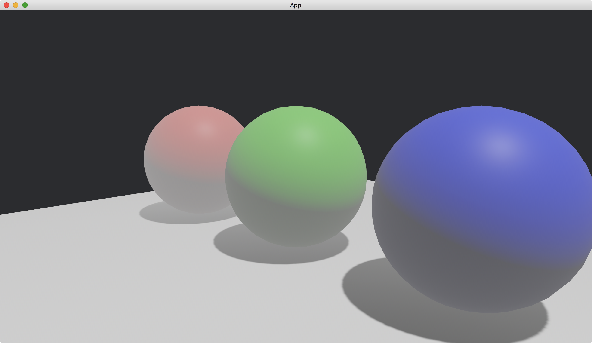

# Basic Fog

Fog in a 3D scene makes objects near the camera clear and objects far away from the camera foggy.

To enable the fog, we use [FogSettings](https://docs.rs/bevy/latest/bevy/pbr/struct.FogSettings.html) together with [Camera3dBundle](https://docs.rs/bevy/latest/bevy/core_pipeline/core_3d/struct.Camera3dBundle.html).
We group the two in the same entity.

```rust
commands.spawn((
    Camera3dBundle {
        transform: Transform::from_xyz(2., 1., 2.).looking_at(Vec3::new(0., 0.5, 0.), Vec3::Y),
        ..default()
    },
    FogSettings {
        color: Color::WHITE,
        falloff: FogFalloff::from_visibility_contrast_squared(0.5, 0.99),
        ..default()
    },
));
```

The [color](https://docs.rs/bevy/latest/bevy/pbr/struct.FogSettings.html#structfield.color) of [FogSettings](https://docs.rs/bevy/latest/bevy/pbr/struct.FogSettings.html) is the color of the fog.
The brightness of the [color](https://docs.rs/bevy/latest/bevy/pbr/struct.FogSettings.html#structfield.color) specifies how strong the fog is.

The [falloff](https://docs.rs/bevy/latest/bevy/pbr/struct.FogSettings.html#structfield.falloff) of [FogSettings](https://docs.rs/bevy/latest/bevy/pbr/struct.FogSettings.html) controls how the fog changes from clear to foggy.
The value of [falloff](https://docs.rs/bevy/latest/bevy/pbr/struct.FogSettings.html#structfield.falloff) is a [FogFalloff](https://docs.rs/bevy/latest/bevy/pbr/enum.FogFalloff.html).
Usually, it is either [Linear](https://docs.rs/bevy/latest/bevy/pbr/enum.FogFalloff.html#variant.Linear), [Exponential](https://docs.rs/bevy/latest/bevy/pbr/enum.FogFalloff.html#variant.Exponential) or [ExponentialSquared](https://docs.rs/bevy/latest/bevy/pbr/enum.FogFalloff.html#variant.ExponentialSquared).
We use [from_visibility_contrast_squared](https://docs.rs/bevy/latest/bevy/pbr/enum.FogFalloff.html#method.from_visibility_contrast_squared) to construct a [FogFalloff](https://docs.rs/bevy/latest/bevy/pbr/enum.FogFalloff.html) of [ExponentialSquared](https://docs.rs/bevy/latest/bevy/pbr/enum.FogFalloff.html#variant.ExponentialSquared).

The full code is as follows:

```rust
use bevy::{
    app::{App, Startup},
    asset::Assets,
    core_pipeline::core_3d::Camera3dBundle,
    ecs::system::{Commands, ResMut},
    math::Vec3,
    pbr::{
        DirectionalLight, DirectionalLightBundle, FogFalloff, FogSettings, PbrBundle,
        StandardMaterial,
    },
    render::{
        color::Color,
        mesh::{
            shape::{Plane, UVSphere},
            Mesh,
        },
    },
    transform::components::Transform,
    utils::default,
    DefaultPlugins,
};

fn main() {
    App::new()
        .add_plugins(DefaultPlugins)
        .add_systems(Startup, setup)
        .run();
}

fn setup(
    mut commands: Commands,
    mut meshes: ResMut<Assets<Mesh>>,
    mut materials: ResMut<Assets<StandardMaterial>>,
) {
    commands.spawn((
        Camera3dBundle {
            transform: Transform::from_xyz(2., 1., 2.).looking_at(Vec3::new(0., 0.5, 0.), Vec3::Y),
            ..default()
        },
        FogSettings {
            color: Color::WHITE,
            falloff: FogFalloff::from_visibility_contrast_squared(0.5, 0.99),
            ..default()
        },
    ));

    // left
    commands.spawn(PbrBundle {
        mesh: meshes.add(
            UVSphere {
                radius: 0.5,
                ..default()
            }
            .into(),
        ),
        material: materials.add(StandardMaterial {
            base_color: Color::RED,
            ..default()
        }),
        transform: Transform::from_xyz(-1.25, 0.5, 0.),
        ..default()
    });

    // middle
    commands.spawn(PbrBundle {
        mesh: meshes.add(
            UVSphere {
                radius: 0.5,
                ..default()
            }
            .into(),
        ),
        material: materials.add(StandardMaterial {
            base_color: Color::GREEN,
            ..default()
        }),
        transform: Transform::from_xyz(0., 0.5, 0.),
        ..default()
    });

    // right
    commands.spawn(PbrBundle {
        mesh: meshes.add(
            UVSphere {
                radius: 0.5,
                ..default()
            }
            .into(),
        ),
        material: materials.add(StandardMaterial {
            base_color: Color::BLUE,
            ..default()
        }),
        transform: Transform::from_xyz(1.25, 0.5, 0.),
        ..default()
    });

    // ground
    commands.spawn(PbrBundle {
        mesh: meshes.add(Plane::from_size(5.).into()),
        material: materials.add(StandardMaterial::default()),
        ..default()
    });

    // light
    commands.spawn(DirectionalLightBundle {
        directional_light: DirectionalLight {
            illuminance: 20000.,
            shadows_enabled: true,
            ..default()
        },
        transform: Transform::default().looking_to(Vec3::new(-1., -3., 0.), Vec3::Y),
        ..default()
    });
}
```

Result:



<!-- :arrow_right:  Next:  -->

:blue_book: Back: [Table of contents](./../README.md)
