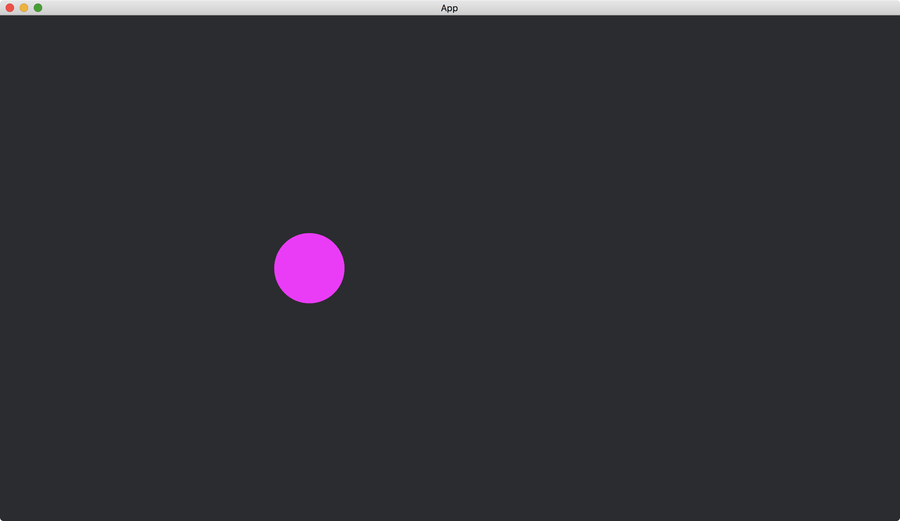
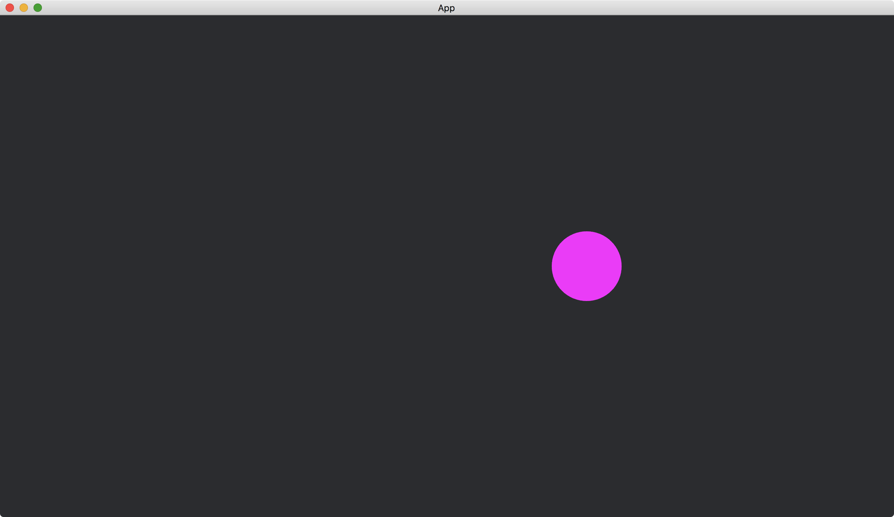

# Changing States

Now consider we have two states

```rust
#[derive(States, Default, Debug, Clone, Eq, PartialEq, Hash)]
enum MyStates {
    #[default]
    FirstState,
    SecondState,
}
```

and the default state is `MyStates::FirstState`.

In the example, when the key `left` is pressed, we move a circle leftward.
And when the key `right` is pressed, we move the circle toward right.
More precisely, when the key `left` is pressed, the app enters `MyStates::FirstState` and calls a system `circle_to_left` that moves the circle to left.
When the key `right` is pressed, the app enters `MyStates::SecondState` and calls a system `circle_to_right` that moves the circle to right.

```rust
App::new().add_state::<MyStates>().add_systems(
        Update,
        (
            circle_to_left.run_if(in_state(MyStates::FirstState)),
            circle_to_right.run_if(in_state(MyStates::SecondState)),
        ),
    )
```

To change the state, we use the resource [NextState](https://docs.rs/bevy/latest/bevy/ecs/schedule/struct.NextState.html)<`MyStates`>.

```rust
fn handle_keys(keyboard_input: Res<Input<KeyCode>>, mut next_state: ResMut<NextState<MyStates>>) {
    if keyboard_input.pressed(KeyCode::Left) {
        next_state.set(MyStates::FirstState);
    }

    if keyboard_input.pressed(KeyCode::Right) {
        next_state.set(MyStates::SecondState);
    }
}
```

We use the method [set](https://docs.rs/bevy/latest/bevy/ecs/schedule/struct.NextState.html#method.set) of [NextState](https://docs.rs/bevy/latest/bevy/ecs/schedule/struct.NextState.html)<`MyStates`> to change the state of `MyStates`.

The full code is as follows:

```rust
use bevy::{
    app::{App, Startup, Update},
    asset::{Assets, Handle},
    core_pipeline::core_2d::Camera2dBundle,
    ecs::{
        query::With,
        schedule::{common_conditions::in_state, IntoSystemConfigs, NextState, States},
        system::{Commands, Query, Res, ResMut},
    },
    input::{keyboard::KeyCode, Input},
    render::mesh::{shape::Circle, Mesh},
    sprite::{ColorMaterial, ColorMesh2dBundle},
    transform::components::Transform,
    utils::default,
    DefaultPlugins,
};

#[derive(States, Default, Debug, Clone, Eq, PartialEq, Hash)]
enum MyStates {
    #[default]
    FirstState,
    SecondState,
}

fn main() {
    App::new()
        .add_plugins(DefaultPlugins)
        .add_state::<MyStates>()
        .add_systems(Startup, setup)
        .add_systems(
            Update,
            (
                handle_keys,
                circle_to_left.run_if(in_state(MyStates::FirstState)),
                circle_to_right.run_if(in_state(MyStates::SecondState)),
            ),
        )
        .run();
}

fn setup(mut commands: Commands, mut meshes: ResMut<Assets<Mesh>>) {
    commands.spawn(Camera2dBundle::default());

    commands.spawn(ColorMesh2dBundle {
        mesh: meshes.add(Circle::new(50.).into()).into(),
        ..default()
    });
}

fn handle_keys(keyboard_input: Res<Input<KeyCode>>, mut next_state: ResMut<NextState<MyStates>>) {
    if keyboard_input.pressed(KeyCode::Left) {
        next_state.set(MyStates::FirstState);
    }

    if keyboard_input.pressed(KeyCode::Right) {
        next_state.set(MyStates::SecondState);
    }
}

fn circle_to_left(mut circles: Query<&mut Transform, With<Handle<ColorMaterial>>>) {
    let mut transform = circles.single_mut();

    *transform = Transform::from_xyz(-200., 0., 0.);
}

fn circle_to_right(mut circles: Query<&mut Transform, With<Handle<ColorMaterial>>>) {
    let mut transform = circles.single_mut();

    *transform = Transform::from_xyz(200., 0., 0.);
}
```

When the key `left` is pressed:



When the key `right` is pressed:



:arrow_right:  Next: [Monitoring State Transition](./monitoring_state_transition.md)

:blue_book: Back: [Table of contents](./../README.md)
