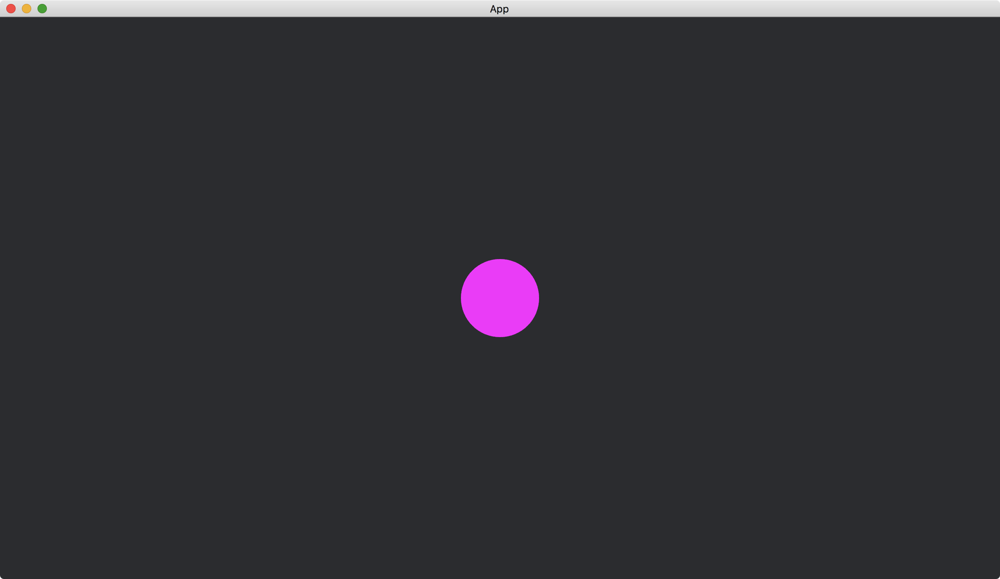

# Circles

To add basic shapes in [bevy::prelude::shape](https://docs.rs/bevy/latest/bevy/prelude/shape/index.html), we can use [ColorMesh2dBundle](https://docs.rs/bevy/latest/bevy/sprite/type.ColorMesh2dBundle.html).

In the following example, we add a [Circle](https://docs.rs/bevy/latest/bevy/prelude/shape/struct.Circle.html) to the app.
The [Circle](https://docs.rs/bevy/latest/bevy/prelude/shape/struct.Circle.html) component takes a radius in its [new](https://docs.rs/bevy/latest/bevy/prelude/shape/struct.Circle.html#method.new) function.
The [Circle](https://docs.rs/bevy/latest/bevy/prelude/shape/struct.Circle.html) is added to the [mesh](https://docs.rs/bevy/latest/bevy/sprite/type.ColorMesh2dBundle.html#structfield.mesh) component in [ColorMesh2dBundle](https://docs.rs/bevy/latest/bevy/sprite/type.ColorMesh2dBundle.html).
This [Circle](https://docs.rs/bevy/latest/bevy/prelude/shape/struct.Circle.html) must also be added to the resource [Assets](https://docs.rs/bevy/latest/bevy/asset/struct.Assets.html)<[Mesh](https://docs.rs/bevy/latest/bevy/render/mesh/struct.Mesh.html)> for working with the underlying engine.

```rust
fn setup(mut commands: Commands, mut meshes: ResMut<Assets<Mesh>>) {
    commands.spawn(Camera2dBundle::default());

    commands.spawn(ColorMesh2dBundle {
        mesh: meshes.add(Circle::new(50.).into()).into(),
        ..default()
    });
}
```

In the code, we use [into()](https://doc.rust-lang.org/std/convert/trait.Into.html#tymethod.into) in several places to convert the structs to the correct types.

The full code is as follows:

```rust
use bevy::{
    app::{App, Startup},
    asset::Assets,
    core_pipeline::core_2d::Camera2dBundle,
    ecs::system::{Commands, ResMut},
    prelude::default,
    render::mesh::{shape::Circle, Mesh},
    sprite::ColorMesh2dBundle,
    DefaultPlugins,
};

fn main() {
    App::new()
        .add_plugins(DefaultPlugins)
        .add_systems(Startup, setup)
        .run();
}

fn setup(mut commands: Commands, mut meshes: ResMut<Assets<Mesh>>) {
    commands.spawn(Camera2dBundle::default());

    commands.spawn(ColorMesh2dBundle {
        mesh: meshes.add(Circle::new(50.).into()).into(),
        ..default()
    });
}
```

Result:



:arrow_right:  Next: [Quads](./quads.md)

:blue_book: Back: [Table of contents](./../README.md)
