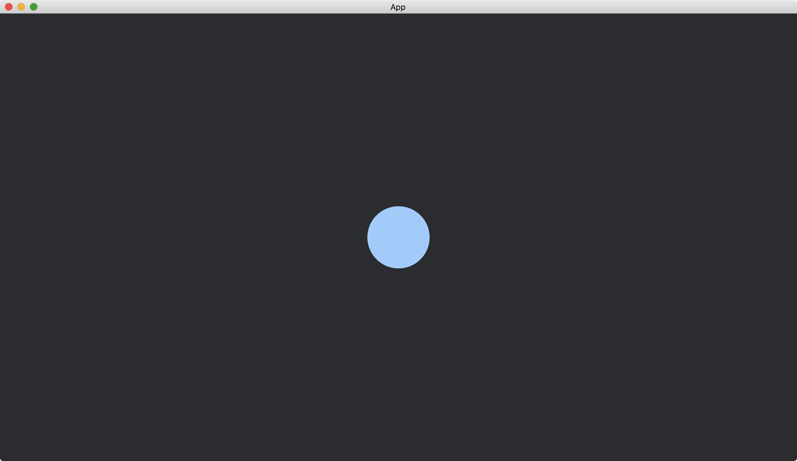

# Colors

In the previous tutorials, we create a [Mesh](https://docs.rs/bevy/latest/bevy/render/mesh/struct.Mesh.html) (such as [Circle](https://docs.rs/bevy/latest/bevy/prelude/shape/struct.Circle.html)) and add it to both resource [Assets](https://docs.rs/bevy/latest/bevy/asset/struct.Assets.html) and [ColorMesh2dBundle](https://docs.rs/bevy/latest/bevy/sprite/type.ColorMesh2dBundle.html) in order to add a shape to our app.
To add a color to a shape, we take a similar approach.

We create a [Color](https://docs.rs/bevy/latest/bevy/render/color/enum.Color.html) and add it to both resource [Assets](https://docs.rs/bevy/latest/bevy/asset/struct.Assets.html) and [ColorMesh2dBundle](https://docs.rs/bevy/latest/bevy/sprite/type.ColorMesh2dBundle.html), too.
The differences are that the assets now is [Assets](https://docs.rs/bevy/latest/bevy/asset/struct.Assets.html)<[ColorMaterial](https://docs.rs/bevy/latest/bevy/sprite/struct.ColorMaterial.html)> (instead of [Assets](https://docs.rs/bevy/latest/bevy/asset/struct.Assets.html)<[Mesh](https://docs.rs/bevy/latest/bevy/render/mesh/struct.Mesh.html)>) and the component we targeted in [ColorMesh2dBundle](https://docs.rs/bevy/latest/bevy/sprite/type.ColorMesh2dBundle.html) is [material](https://docs.rs/bevy/latest/bevy/sprite/struct.MaterialMesh2dBundle.html#structfield.material) (instead of [mesh](https://docs.rs/bevy/latest/bevy/sprite/struct.MaterialMesh2dBundle.html#structfield.mesh)).

```rust
fn setup(
    mut commands: Commands,
    mut meshes: ResMut<Assets<Mesh>>,
    mut materials: ResMut<Assets<ColorMaterial>>,
) {
    // ...

    commands.spawn(ColorMesh2dBundle {
        mesh: meshes.add(Circle::new(50.).into()).into(),
        material: materials.add(Color::hsl(210., 1., 0.8).into()),
        ..default()
    });
}
```

The full code is as follows:

```rust
use bevy::{
    app::{App, Startup},
    asset::Assets,
    core_pipeline::core_2d::Camera2dBundle,
    ecs::system::{Commands, ResMut},
    prelude::default,
    render::{
        color::Color,
        mesh::{shape::Circle, Mesh},
    },
    sprite::{ColorMaterial, ColorMesh2dBundle},
    DefaultPlugins,
};

fn main() {
    App::new()
        .add_plugins(DefaultPlugins)
        .add_systems(Startup, setup)
        .run();
}

fn setup(
    mut commands: Commands,
    mut meshes: ResMut<Assets<Mesh>>,
    mut materials: ResMut<Assets<ColorMaterial>>,
) {
    commands.spawn(Camera2dBundle::default());

    commands.spawn(ColorMesh2dBundle {
        mesh: meshes.add(Circle::new(50.).into()).into(),
        material: materials.add(Color::hsl(210., 1., 0.8).into()),
        ..default()
    });
}
```

Result:



We use [Circle](https://docs.rs/bevy/latest/bevy/prelude/shape/struct.Circle.html) in the example.
The method applies to other shapes.

:arrow_right:  Next: [Textures](./textures.md)

:blue_book: Back: [Table of contents](./../README.md)
