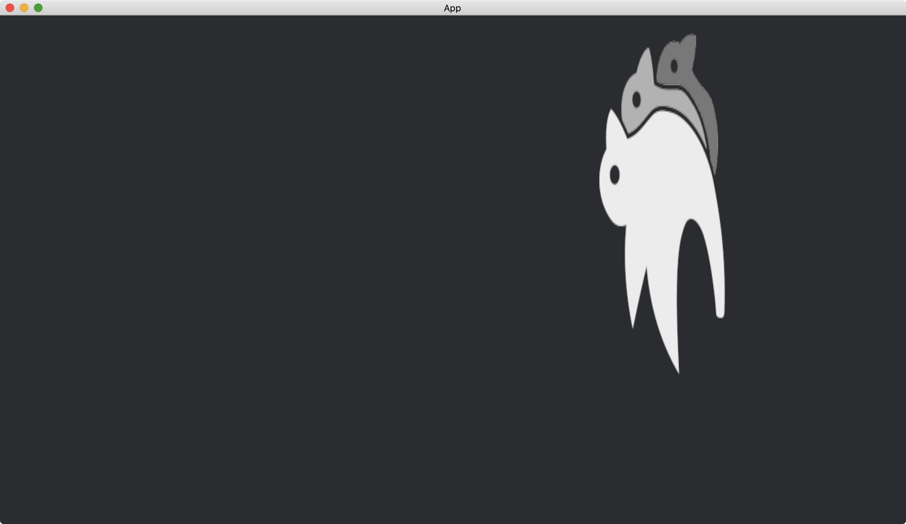

# Combining Multiple Transformation

In a [Transform](https://docs.rs/bevy/latest/bevy/transform/components/struct.Transform.html), translations, rotations and scales can be performed at the same time.
We do so by setting the fields [translation](https://docs.rs/bevy/latest/bevy/transform/components/struct.Transform.html#structfield.translation), [rotation](https://docs.rs/bevy/latest/bevy/transform/components/struct.Transform.html#structfield.rotation) and [scale](https://docs.rs/bevy/latest/bevy/transform/components/struct.Transform.html#structfield.scale) when constructing a [Transform](https://docs.rs/bevy/latest/bevy/transform/components/struct.Transform.html).

```rust
fn setup(mut commands: Commands, asset_server: Res<AssetServer>) {
    commands.spawn(Camera2dBundle::default());

    commands.spawn(SpriteBundle {
        texture: asset_server.load("bevy_bird_dark.png"),
        transform: Transform {
            translation: (300., 100., 0.).into(),
            rotation: Quat::from_rotation_z(1.57),
            scale: (2., 1., 1.).into(),
        },
        ..default()
    });
}
```

When all the fields are set, the result can be treated as performing the [rotation](https://docs.rs/bevy/latest/bevy/transform/components/struct.Transform.html#structfield.rotation) and [scale](https://docs.rs/bevy/latest/bevy/transform/components/struct.Transform.html#structfield.scale) first and then the [translation](https://docs.rs/bevy/latest/bevy/transform/components/struct.Transform.html#structfield.translation).

The full code is as follows:

```rust
use bevy::{
    app::{App, Startup},
    asset::AssetServer,
    core_pipeline::core_2d::Camera2dBundle,
    ecs::system::{Commands, Res},
    math::Quat,
    sprite::SpriteBundle,
    transform::components::Transform,
    utils::default,
    DefaultPlugins,
};

fn main() {
    App::new()
        .add_plugins(DefaultPlugins)
        .add_systems(Startup, setup)
        .run();
}

fn setup(mut commands: Commands, asset_server: Res<AssetServer>) {
    commands.spawn(Camera2dBundle::default());

    commands.spawn(SpriteBundle {
        texture: asset_server.load("bevy_bird_dark.png"),
        transform: Transform {
            translation: (300., 100., 0.).into(),
            rotation: Quat::from_rotation_z(1.57),
            scale: (2., 1., 1.).into(),
        },
        ..default()
    });
}
```

Result:



Sometimes, we would like the [translation](https://docs.rs/bevy/latest/bevy/transform/components/struct.Transform.html#structfield.translation) to be performed prior to the [rotation](https://docs.rs/bevy/latest/bevy/transform/components/struct.Transform.html#structfield.rotation).
In this case, we can use [mul_transform](https://docs.rs/bevy/latest/bevy/transform/components/struct.Transform.html#method.mul_transform) of [Transform](https://docs.rs/bevy/latest/bevy/transform/components/struct.Transform.html) to combine two transformation.

Be careful with the order of [mul_transform](https://docs.rs/bevy/latest/bevy/transform/components/struct.Transform.html#method.mul_transform).
For two transformation `A` and `B`, `A.mul_transform(B)` means `B` will be performed prior to `A`.
This is due to the nature of the underlying mathematics.

In the following example, we translate an image to the right of the origin first and then we rotate the image counter-clockwise based on the origin.
The transformed image will be closer to the top-right corner of the window.

```rust
use bevy::{
    app::{App, Startup},
    asset::AssetServer,
    core_pipeline::core_2d::Camera2dBundle,
    ecs::system::{Commands, Res},
    math::Quat,
    sprite::SpriteBundle,
    transform::components::Transform,
    utils::default,
    DefaultPlugins,
};

fn main() {
    App::new()
        .add_plugins(DefaultPlugins)
        .add_systems(Startup, setup)
        .run();
}

fn setup(mut commands: Commands, asset_server: Res<AssetServer>) {
    commands.spawn(Camera2dBundle::default());

    commands.spawn(SpriteBundle {
        texture: asset_server.load("bevy_bird_dark.png"),
        transform: Transform::from_rotation(Quat::from_rotation_z(0.79))
            .mul_transform(Transform::from_xyz(300., 0., 0.)),
        ..default()
    });
}
```

Result:


The method [mul_transform](https://docs.rs/bevy/latest/bevy/transform/components/struct.Transform.html#method.mul_transform) can also help us combining multiple transformation.
For example, to combine three transformation `A`, `B` and `C`, we can write `A.mul_transform(B.mul_transform(C))`.

:arrow_right:  Next: [Displaying Texts](./displaying_texts.md)

:blue_book: Back: [Table of contents](./../README.md)
