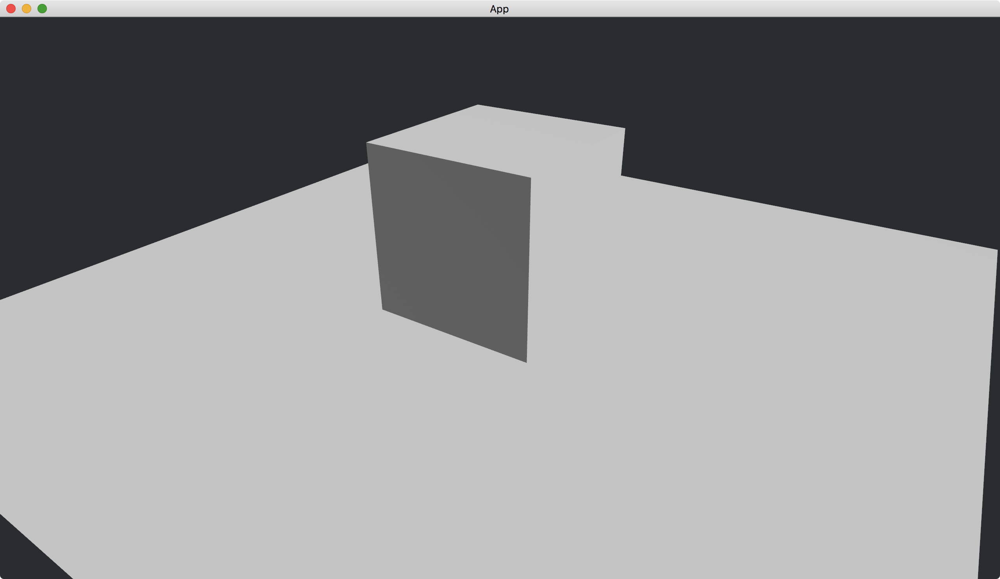

# Directional Light

Directional light is similar to ambient light, but with explicit direction.
Surfaces that directly face to the light are brighter than surfaces with other directions.

We use [DirectionalLightBundle](https://docs.rs/bevy/latest/bevy/pbr/struct.DirectionalLightBundle.html) to create a directional light.

```rust
commands.spawn(DirectionalLightBundle {
    directional_light: DirectionalLight {
        illuminance: 20000.,
        ..default()
    },
    transform: Transform::default().looking_to(Vec3::new(-1., -1., -0.1), Vec3::Y),
    ..default()
});
```

We use [illuminance](https://docs.rs/bevy/latest/bevy/pbr/struct.DirectionalLight.html#structfield.illuminance) of [directional_light](https://docs.rs/bevy/latest/bevy/pbr/struct.DirectionalLightBundle.html#structfield.directional_light) to set the brightness of the light.
The larger the brighter.
See [the table](https://docs.rs/bevy/latest/bevy/pbr/struct.DirectionalLight.html) for valid values for [illuminance](https://docs.rs/bevy/latest/bevy/pbr/struct.DirectionalLight.html#structfield.illuminance).

The [transform](https://docs.rs/bevy/latest/bevy/pbr/struct.DirectionalLightBundle.html#structfield.transform) of [DirectionalLightBundle](https://docs.rs/bevy/latest/bevy/pbr/struct.DirectionalLightBundle.html) sets the direction of the light.
We can use the method [looking_to](https://docs.rs/bevy/latest/bevy/transform/components/struct.Transform.html#method.looking_to) to set the direction.
In the example, we set the direction to `(-1, -1, -0.1)` (so the light comes from the direction `(1, 1, 0.1)`).

We place a [Plane](https://docs.rs/bevy/latest/bevy/prelude/shape/struct.Plane.html) to indicate the x-z plane and put a [Cube](https://docs.rs/bevy/latest/bevy/prelude/shape/struct.Cube.html) on it.
We set our camera position to `(2, 2, 3)` and make it looking at the origin.

The full code is as follows:

```rust
use bevy::{
    app::{App, Startup},
    asset::Assets,
    core_pipeline::core_3d::Camera3dBundle,
    ecs::system::{Commands, ResMut},
    math::Vec3,
    pbr::{DirectionalLight, DirectionalLightBundle, PbrBundle, StandardMaterial},
    render::mesh::{
        shape::{Cube, Plane},
        Mesh,
    },
    transform::components::Transform,
    utils::default,
    DefaultPlugins,
};

fn main() {
    App::new()
        .add_plugins(DefaultPlugins)
        .add_systems(Startup, setup)
        .run();
}

fn setup(
    mut commands: Commands,
    mut meshes: ResMut<Assets<Mesh>>,
    mut materials: ResMut<Assets<StandardMaterial>>,
) {
    commands.spawn(Camera3dBundle {
        transform: Transform::from_xyz(2., 2., 3.).looking_at(Vec3::ZERO, Vec3::Y),
        ..default()
    });

    commands.spawn(PbrBundle {
        mesh: meshes.add(Cube::new(1.).into()).into(),
        transform: Transform::from_xyz(0., 0.5, 0.),
        material: materials.add(StandardMaterial::default()).into(),
        ..default()
    });

    commands.spawn(PbrBundle {
        mesh: meshes.add(Plane::from_size(5.).into()).into(),
        material: materials.add(StandardMaterial::default()).into(),
        ..default()
    });

    commands.spawn(DirectionalLightBundle {
        directional_light: DirectionalLight {
            illuminance: 20000.,
            ..default()
        },
        transform: Transform::default().looking_to(Vec3::new(-1., -1., -0.1), Vec3::Y),
        ..default()
    });
}
```

Result:



:arrow_right:  Next: [Point Light](./point_light.md)

:blue_book: Back: [Table of contents](./../README.md)
