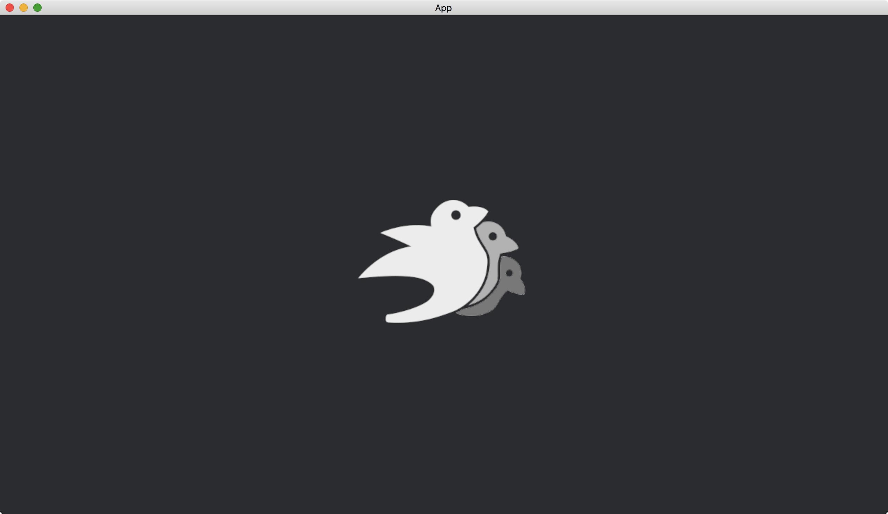

# Displaying Images

Most of developers use [Bevy](https://bevyengine.org/) for game development, which usually involves lots of images.

To display an image, the image must be stored in the directory `assets` in the project root directory.
Assume we have an image named `bevy_bird_dark.png` in the directory `assets`.

We use the resource [AssetServer](https://docs.rs/bevy/latest/bevy/asset/struct.AssetServer.html) to load images from the file system.
The [load](https://docs.rs/bevy/latest/bevy/asset/struct.AssetServer.html#method.load) method of [AssetServer](https://docs.rs/bevy/latest/bevy/asset/struct.AssetServer.html) returns a [Handle](https://docs.rs/bevy/latest/bevy/asset/enum.Handle.html), which can be treated as a special type of pointers in [Bevy](https://bevyengine.org/).
We pass the [Handle](https://docs.rs/bevy/latest/bevy/asset/enum.Handle.html) into a [SpriteBundle](https://docs.rs/bevy/latest/bevy/sprite/struct.SpriteBundle.html) as its [texture](https://docs.rs/bevy/latest/bevy/sprite/struct.SpriteBundle.html#structfield.texture).

```rust
fn setup(mut commands: Commands, asset_server: Res<AssetServer>) {
    commands.spawn(Camera2dBundle::default());

    commands.spawn(SpriteBundle {
        texture: asset_server.load("bevy_bird_dark.png"),
        ..default()
    });
}
```

After the [SpriteBundle](https://docs.rs/bevy/latest/bevy/sprite/struct.SpriteBundle.html) is [spawn](https://docs.rs/bevy/latest/bevy/ecs/system/struct.Commands.html#method.spawn)ed, the image will be drawn on the screen as soon as it is ready, and will remain on the screen until it is despawned.

The origin of the camera of [Camera2dBundle](https://docs.rs/bevy/latest/bevy/core_pipeline/core_2d/struct.Camera2dBundle.html) is at the center of the window.
The default [SpriteBundle](https://docs.rs/bevy/latest/bevy/sprite/struct.SpriteBundle.html) will align the image centered at the origin.
Thus the image is at the center of the window.

The full code is as follows:

```rust
use bevy::{
    app::{App, Startup},
    asset::AssetServer,
    core_pipeline::core_2d::Camera2dBundle,
    ecs::system::{Commands, Res},
    sprite::SpriteBundle,
    utils::default,
    DefaultPlugins,
};

fn main() {
    App::new()
        .add_plugins(DefaultPlugins)
        .add_systems(Startup, setup)
        .run();
}

fn setup(mut commands: Commands, asset_server: Res<AssetServer>) {
    commands.spawn(Camera2dBundle::default());

    commands.spawn(SpriteBundle {
        texture: asset_server.load("bevy_bird_dark.png"),
        ..default()
    });
}
```

Result:



<!-- :arrow_right:  Next:  -->

:blue_book: Back: [Table of contents](./../README.md)
