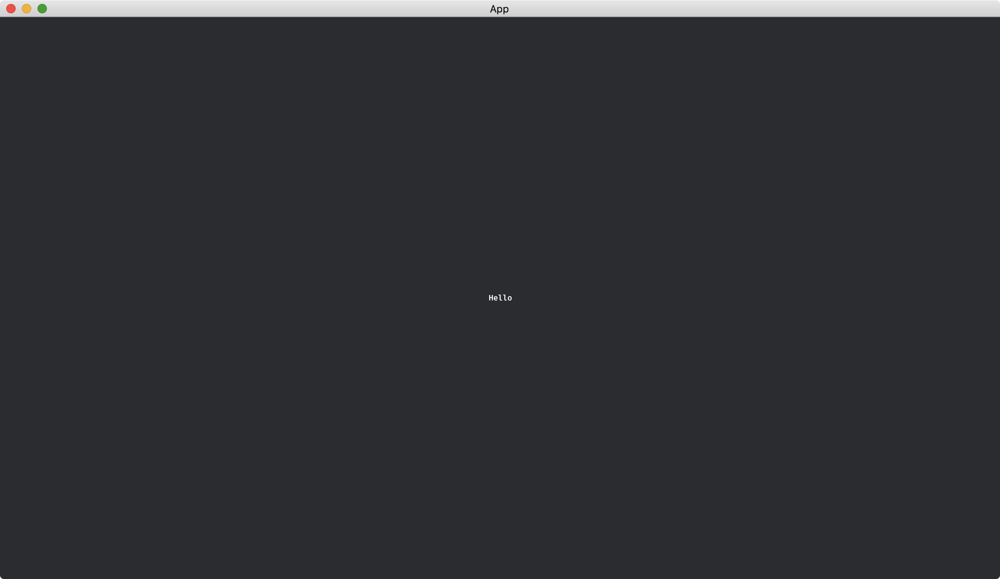

# Displaying Texts

To have texts on the screen, we can use [Text2dBundle](https://docs.rs/bevy/latest/bevy/text/struct.Text2dBundle.html).

```rust
fn setup(mut commands: Commands) {
    commands.spawn(Camera2dBundle::default());

    commands.spawn(Text2dBundle {
        text: Text::from_section("Hello", TextStyle::default()),
        ..default()
    });
}
```

We set the [Text](https://docs.rs/bevy/latest/bevy/text/struct.Text.html) of [Text2dBundle](https://docs.rs/bevy/latest/bevy/text/struct.Text2dBundle.html) and initialize it to a string that is going to be displayed.
Currently, we use [TextStyle::default()](https://docs.rs/bevy/latest/bevy/text/struct.TextStyle.html#method.default) for the default style.

The full code is as follows:

```rust
use bevy::{
    app::{App, Startup},
    core_pipeline::core_2d::Camera2dBundle,
    ecs::system::Commands,
    text::{Text, Text2dBundle, TextStyle},
    utils::default,
    DefaultPlugins,
};

fn main() {
    App::new()
        .add_plugins(DefaultPlugins)
        .add_systems(Startup, setup)
        .run();
}

fn setup(mut commands: Commands) {
    commands.spawn(Camera2dBundle::default());

    commands.spawn(Text2dBundle {
        text: Text::from_section("Hello", TextStyle::default()),
        ..default()
    });
}
```

Result:



:arrow_right:  Next: [Font Styles](./font_styles.md)

:blue_book: Back: [Table of contents](./../README.md)
