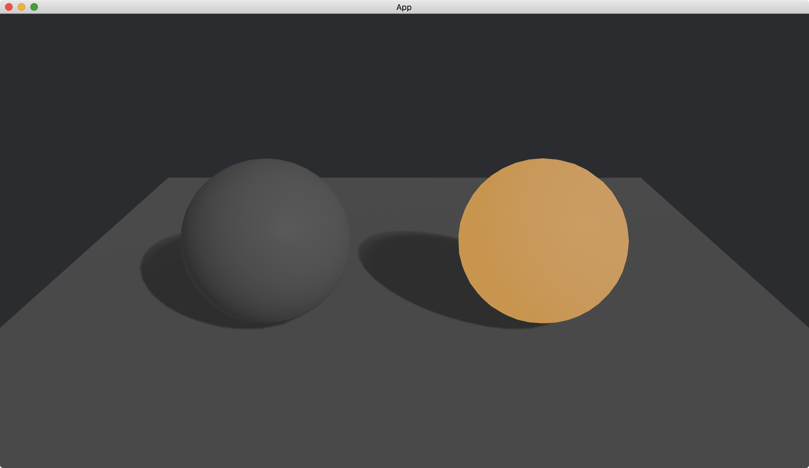

# Emissive

We can make an object visible even if there is no light.

To do this, we use [emissive](https://docs.rs/bevy/latest/bevy/pbr/struct.StandardMaterial.html#structfield.emissive) in [StandardMaterial](https://docs.rs/bevy/latest/bevy/pbr/struct.StandardMaterial.html).

```rust
commands.spawn(PbrBundle {
    material: materials.add(StandardMaterial {
        emissive: Color::ORANGE,
        ..default()
    }),
    ..default()
});
```

The value of [emissive](https://docs.rs/bevy/latest/bevy/pbr/struct.StandardMaterial.html#structfield.emissive) is a [Color](https://docs.rs/bevy/latest/bevy/render/color/enum.Color.html), which is the color of the object that is visible even if there is no light.

In the following example, we create two spheres.
The left sphere has no emissive color and the right one has an emissive color of orange.
To make the difference obvious, we set the light to be very dark.

The full code is as follows:

```rust
use bevy::{
    app::{App, Startup},
    asset::Assets,
    core_pipeline::core_3d::Camera3dBundle,
    ecs::system::{Commands, ResMut},
    math::Vec3,
    pbr::{DirectionalLight, DirectionalLightBundle, PbrBundle, StandardMaterial},
    render::{
        color::Color,
        mesh::{
            shape::{Plane, UVSphere},
            Mesh,
        },
    },
    transform::components::Transform,
    utils::default,
    DefaultPlugins,
};

fn main() {
    App::new()
        .add_plugins(DefaultPlugins)
        .add_systems(Startup, setup)
        .run();
}

fn setup(
    mut commands: Commands,
    mut meshes: ResMut<Assets<Mesh>>,
    mut materials: ResMut<Assets<StandardMaterial>>,
) {
    commands.spawn(Camera3dBundle {
        transform: Transform::from_xyz(0., 2., 3.).looking_at(Vec3::new(0., 0.5, 0.), Vec3::Y),
        ..default()
    });

    // left
    commands.spawn(PbrBundle {
        mesh: meshes.add(
            UVSphere {
                radius: 0.5,
                ..default()
            }
            .into(),
        ),
        material: materials.add(StandardMaterial::default()),
        transform: Transform::from_xyz(-0.83, 0.5, 0.),
        ..default()
    });

    // right
    commands.spawn(PbrBundle {
        mesh: meshes.add(
            UVSphere {
                radius: 0.5,
                ..default()
            }
            .into(),
        ),
        material: materials.add(StandardMaterial {
            emissive: Color::ORANGE,
            ..default()
        }),
        transform: Transform::from_xyz(0.83, 0.5, 0.),
        ..default()
    });

    commands.spawn(PbrBundle {
        mesh: meshes.add(Plane::from_size(5.).into()),
        material: materials.add(StandardMaterial::default()),
        ..default()
    });

    commands.spawn(DirectionalLightBundle {
        directional_light: DirectionalLight {
            illuminance: 1000.,
            shadows_enabled: true,
            ..default()
        },
        transform: Transform::default().looking_to(Vec3::new(-1., -1., -1.), Vec3::Y),
        ..default()
    });
}
```

Result:



<!-- :arrow_right:  Next:  -->

:blue_book: Back: [Table of contents](./../README.md)
