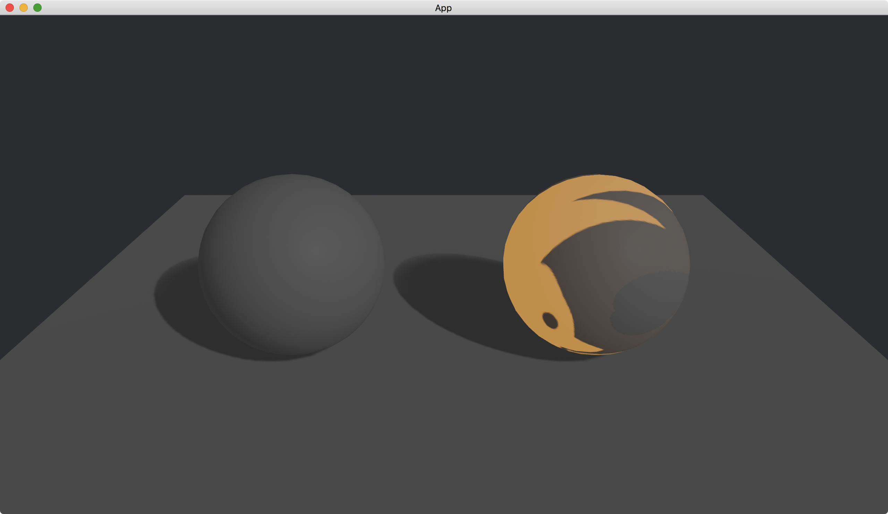

# Emissive Textures

On top of [emissive](https://docs.rs/bevy/latest/bevy/pbr/struct.StandardMaterial.html#structfield.emissive), we can control an object's part that is visible when there is no light.
Instead of making the whole object emissive, we can only make a part of the object emissive.

To do this, we use both [emissive](https://docs.rs/bevy/latest/bevy/pbr/struct.StandardMaterial.html#structfield.emissive) and [emissive_texture](https://docs.rs/bevy/latest/bevy/pbr/struct.StandardMaterial.html#structfield.emissive_texture) in [StandardMaterial](https://docs.rs/bevy/latest/bevy/pbr/struct.StandardMaterial.html).

```rust
commands.spawn(PbrBundle {
    material: materials.add(StandardMaterial {
        emissive: Color::ORANGE,
        emissive_texture: Some(asset_server.load("icon.png")),
        ..default()
    }),
    ..default()
});
```

The value of [emissive_texture](https://docs.rs/bevy/latest/bevy/pbr/struct.StandardMaterial.html#structfield.emissive_texture) is an [Option](https://doc.rust-lang.org/nightly/core/option/enum.Option.html)<[Handle](https://docs.rs/bevy/latest/bevy/asset/enum.Handle.html)<[Image](https://docs.rs/bevy/latest/bevy/render/texture/struct.Image.html)>>.
We set the [Handle](https://docs.rs/bevy/latest/bevy/asset/enum.Handle.html)<[Image](https://docs.rs/bevy/latest/bevy/render/texture/struct.Image.html)> to the texture [icon.png](https://github.com/bevyengine/bevy/blob/main/assets/branding/icon.png?raw=true).
Only the light color of the texture is emissive in the 3D scene.

In the following example, we create two spheres.
The left sphere has no emissive color and the right one has an emissive orange color with the texture.
To make the difference obvious, we set the light to be very dark.

The full code is as follows:

```rust
use bevy::{
    app::{App, Startup},
    asset::{AssetServer, Assets},
    core_pipeline::core_3d::Camera3dBundle,
    ecs::system::{Commands, Res, ResMut},
    math::Vec3,
    pbr::{DirectionalLight, DirectionalLightBundle, PbrBundle, StandardMaterial},
    render::{
        color::Color,
        mesh::{
            shape::{Plane, UVSphere},
            Mesh,
        },
    },
    transform::components::Transform,
    utils::default,
    DefaultPlugins,
};

fn main() {
    App::new()
        .add_plugins(DefaultPlugins)
        .add_systems(Startup, setup)
        .run();
}

fn setup(
    mut commands: Commands,
    mut meshes: ResMut<Assets<Mesh>>,
    mut materials: ResMut<Assets<StandardMaterial>>,
    asset_server: Res<AssetServer>,
) {
    commands.spawn(Camera3dBundle {
        transform: Transform::from_xyz(0., 2., 3.).looking_at(Vec3::new(0., 0.5, 0.), Vec3::Y),
        ..default()
    });

    // left
    commands.spawn(PbrBundle {
        mesh: meshes.add(
            UVSphere {
                radius: 0.5,
                ..default()
            }
            .into(),
        ),
        material: materials.add(StandardMaterial::default()),
        transform: Transform::from_xyz(-0.83, 0.5, 0.),
        ..default()
    });

    // right
    commands.spawn(PbrBundle {
        mesh: meshes.add(
            UVSphere {
                radius: 0.5,
                ..default()
            }
            .into(),
        ),
        material: materials.add(StandardMaterial {
            emissive: Color::ORANGE,
            emissive_texture: Some(asset_server.load("icon.png")),
            ..default()
        }),
        transform: Transform::from_xyz(0.83, 0.5, 0.),
        ..default()
    });

    commands.spawn(PbrBundle {
        mesh: meshes.add(Plane::from_size(5.).into()),
        material: materials.add(StandardMaterial::default()),
        ..default()
    });

    commands.spawn(DirectionalLightBundle {
        directional_light: DirectionalLight {
            illuminance: 1000.,
            shadows_enabled: true,
            ..default()
        },
        transform: Transform::default().looking_to(Vec3::new(-1., -1., -1.), Vec3::Y),
        ..default()
    });
}
```

Result:



:arrow_right:  Next: [Alpha Mode](./alpha_mode.md)

:blue_book: Back: [Table of contents](./../README.md)
