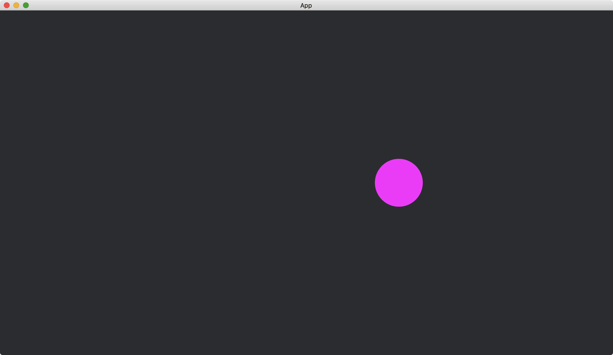

# Engine Time

When we start a [Bevy](https://bevyengine.org/) app, the underlying timer also starts.
We can retrieve the information about the time related to the underlying timer.

In the following example, we retrieve the elapsed time after the [App](https://docs.rs/bevy/latest/bevy/app/struct.App.html) is run.
We use this information to move a [Circle](https://docs.rs/bevy/0.12.1/bevy/prelude/shape/struct.Circle.html).

```rust
fn circle_moves(time: Res<Time>, mut circles: Query<&mut Transform, With<Handle<ColorMaterial>>>) {
    let mut transform = circles.single_mut();

    *transform = Transform::from_xyz(time.elapsed_seconds().sin() * 200., 0., 0.);
}
```

We use the resource [Time](https://docs.rs/bevy/latest/bevy/time/struct.Time.html) to retrieve the time information.
The method [elapsed_seconds()](https://docs.rs/bevy/latest/bevy/time/struct.Time.html#method.elapsed_seconds) of [Time](https://docs.rs/bevy/latest/bevy/time/struct.Time.html) returns the seconds passed after the app is run.

Result:



We can use the method [elapsed()](https://docs.rs/bevy/latest/bevy/time/struct.Time.html#method.elapsed) to customize the unit of the elapsed time.

:arrow_right:  Next: [A Timer Running Once](./a_timer_running_once.md)

:blue_book: Back: [Table of contents](./../README.md)
