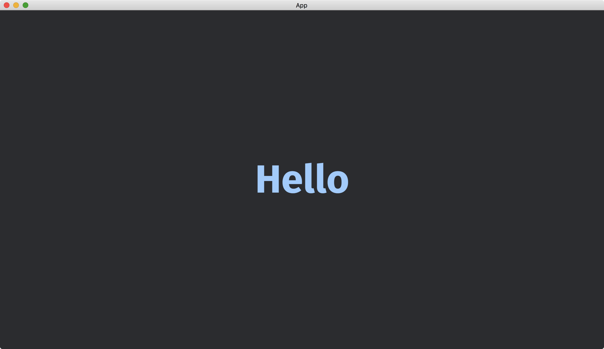

# Font Styles

We can change the font, size and color of texts.

Assume we have a font file [FiraSans-Bold.ttf](https://github.com/bevyengine/bevy/blob/main/assets/fonts/FiraSans-Bold.ttf) in the `assets` directory.
We can set the [font](https://docs.rs/bevy/latest/bevy/text/struct.TextStyle.html#structfield.font), [font_size](https://docs.rs/bevy/latest/bevy/text/struct.TextStyle.html#structfield.font_size) and [color](https://docs.rs/bevy/latest/bevy/text/struct.TextStyle.html#structfield.color) of [TextStyle](https://docs.rs/bevy/latest/bevy/text/struct.TextStyle.html) when we create a [Text](https://docs.rs/bevy/latest/bevy/text/struct.Text.html).

```rust
fn setup(mut commands: Commands, asset_server: Res<AssetServer>) {
    commands.spawn(Camera2dBundle::default());

    commands.spawn(Text2dBundle {
        text: Text::from_section(
            "Hello",
            TextStyle {
                font: asset_server.load("FiraSans-Bold.ttf"),
                font_size: 100.,
                color: Color::hsl(210., 1., 0.8),
            },
        ),
        ..default()
    });
}
```

We use the resource [AssetServer](https://docs.rs/bevy/latest/bevy/asset/struct.AssetServer.html) to load the font, just like how we load an image.

The full code is as follows:

```rust
use bevy::{
    app::{App, Startup},
    asset::AssetServer,
    core_pipeline::core_2d::Camera2dBundle,
    ecs::system::{Commands, Res},
    render::color::Color,
    text::{Text, Text2dBundle, TextStyle},
    utils::default,
    DefaultPlugins,
};

fn main() {
    App::new()
        .add_plugins(DefaultPlugins)
        .add_systems(Startup, setup)
        .run();
}

fn setup(mut commands: Commands, asset_server: Res<AssetServer>) {
    commands.spawn(Camera2dBundle::default());

    commands.spawn(Text2dBundle {
        text: Text::from_section(
            "Hello",
            TextStyle {
                font: asset_server.load("FiraSans-Bold.ttf"),
                font_size: 100.,
                color: Color::hsl(210., 1., 0.8),
            },
        ),
        ..default()
    });
}
```

Result:



A text can have different styles for different substrings.
To achieve this, instead of using [Text::from_section](https://docs.rs/bevy/latest/bevy/text/struct.Text.html#method.from_section), we use [Text::from_sections](https://docs.rs/bevy/latest/bevy/text/struct.Text.html#method.from_sections).
The function [Text::from_sections](https://docs.rs/bevy/latest/bevy/text/struct.Text.html#method.from_sections) accepts an array of [TextSection](https://docs.rs/bevy/latest/bevy/text/struct.TextSection.html), where each [TextSection](https://docs.rs/bevy/latest/bevy/text/struct.TextSection.html) describes a string and its style.

```rust
use bevy::{
    app::{App, Startup},
    asset::AssetServer,
    core_pipeline::core_2d::Camera2dBundle,
    ecs::system::{Commands, Res},
    render::color::Color,
    text::{Text, Text2dBundle, TextSection, TextStyle},
    utils::default,
    DefaultPlugins,
};

fn main() {
    App::new()
        .add_plugins(DefaultPlugins)
        .add_systems(Startup, setup)
        .run();
}

fn setup(mut commands: Commands, asset_server: Res<AssetServer>) {
    commands.spawn(Camera2dBundle::default());

    commands.spawn(Text2dBundle {
        text: Text::from_sections([
            TextSection::new(
                "Hello ",
                TextStyle {
                    font_size: 100.,
                    color: Color::hsl(210., 1., 0.7),
                    ..default()
                },
            ),
            TextSection::new(
                "World",
                TextStyle {
                    font: asset_server.load("FiraSans-Bold.ttf"),
                    font_size: 120.,
                    color: Color::hsl(30., 1., 0.6),
                },
            ),
        ]),
        ..default()
    });
}
```

Result:


:arrow_right:  Next: [Text Positions](./text_positions.md)

:blue_book: Back: [Table of contents](./../README.md)
