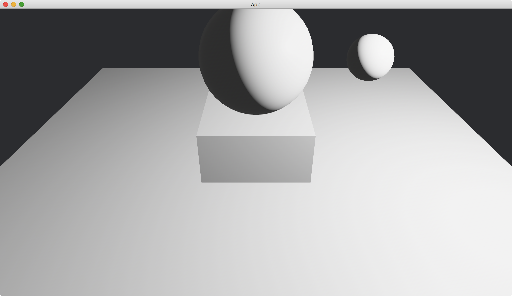

# Hierarchical Transformation

Transformation can be made hierarchical.
In a hierarchical structure, the transformation of some objects is relative to the transformation of other objects.

To build a hierarchical structure, we use the method [with_children](https://docs.rs/bevy/latest/bevy/ecs/system/struct.EntityCommands.html#method.with_children) after [spawn](https://docs.rs/bevy/latest/bevy/ecs/system/struct.Commands.html#method.spawn)ing an entity.

```rust
commands.spawn( /* ... */ ).with_children(|parent| {
    parent.spawn( /* ... */ );
    // ...
});
```

The method [with_children](https://docs.rs/bevy/latest/bevy/ecs/system/struct.EntityCommands.html#method.with_children) accepts a closure that takes a parameter, usually named `parent`.
The usage of the parameter `parent` is similar to [Commands](https://docs.rs/bevy/latest/bevy/ecs/system/struct.Commands.html).
We can use `parent.spawn` to spawn entities.

In the following example, we create a large sphere that is translated up (toward positive y) a little bit.
And then we create a small sphere that is specified as a child of the large sphere.
The small sphere is translated right (toward positive x) a little bit.

```rust
commands
    .spawn(PbrBundle {
        mesh: meshes
            .add(
                UVSphere {
                    radius: 0.5,
                    ..default()
                }
                .into(),
            )
            .into(),
        transform: Transform::from_xyz(0., 1., 0.),
        ..default()
    })
    .with_children(|parent| {
        parent.spawn(PbrBundle {
            mesh: meshes
                .add(
                    UVSphere {
                        radius: 0.2,
                        ..default()
                    }
                    .into(),
                )
                .into(),
            transform: Transform::from_xyz(1., 0., 0.),
            ..default()
        });
    });
```

Since the small sphere is a child of the large sphere, its transformation is relative to that of the large sphere.

In addition, we add a [Cube](https://docs.rs/bevy/latest/bevy/prelude/shape/struct.Cube.html) to show the position of the origin and add a [Plane](https://docs.rs/bevy/latest/bevy/prelude/shape/struct.Plane.html) to indicate the x-z plane.

We set our camera position to `(0, 2, 3)` and make it looking at the origin.

The full code is as follows:

```rust
use bevy::{
    app::{App, Startup},
    asset::Assets,
    core_pipeline::core_3d::Camera3dBundle,
    ecs::system::{Commands, ResMut},
    hierarchy::BuildChildren,
    math::Vec3,
    pbr::{PbrBundle, PointLightBundle, StandardMaterial},
    render::mesh::{
        shape::{Cube, Plane, UVSphere},
        Mesh,
    },
    transform::components::Transform,
    utils::default,
    DefaultPlugins,
};

fn main() {
    App::new()
        .add_plugins(DefaultPlugins)
        .add_systems(Startup, setup)
        .run();
}

fn setup(
    mut commands: Commands,
    mut meshes: ResMut<Assets<Mesh>>,
    mut materials: ResMut<Assets<StandardMaterial>>,
) {
    commands.spawn(Camera3dBundle {
        transform: Transform::from_xyz(0., 2., 3.).looking_at(Vec3::ZERO, Vec3::Y),
        ..default()
    });

    commands
        .spawn(PbrBundle {
            mesh: meshes
                .add(
                    UVSphere {
                        radius: 0.5,
                        ..default()
                    }
                    .into(),
                )
                .into(),
            material: materials.add(StandardMaterial::default()).into(),
            transform: Transform::from_xyz(0., 1., 0.),
            ..default()
        })
        .with_children(|parent| {
            parent.spawn(PbrBundle {
                mesh: meshes
                    .add(
                        UVSphere {
                            radius: 0.2,
                            ..default()
                        }
                        .into(),
                    )
                    .into(),
                material: materials.add(StandardMaterial::default()).into(),
                transform: Transform::from_xyz(1., 0., 0.),
                ..default()
            });
        });

    commands.spawn(PbrBundle {
        mesh: meshes.add(Cube::new(1.).into()).into(),
        material: materials.add(StandardMaterial::default()).into(),
        ..default()
    });

    commands.spawn(PbrBundle {
        mesh: meshes.add(Plane::from_size(5.).into()).into(),
        material: materials.add(StandardMaterial::default()).into(),
        ..default()
    });

    commands.spawn(PointLightBundle {
        transform: Transform::from_xyz(2., 2., 1.),
        ..default()
    });
}
```

Result:



Although we only set the transformation of the small sphere to be translated along the x-axis, the result transformation of the small sphere also translates along the y-axis.

To remove objects in a hierarchical structure (i.e., to remove a parent as well as all its children), we can use `commands.entity(id).despawn_recursive()` where `id` is an [Entity](https://docs.rs/bevy/latest/bevy/ecs/entity/struct.Entity.html).

:arrow_right:  Next: [Ambient Light](./ambient_light.md)

:blue_book: Back: [Table of contents](./../README.md)
