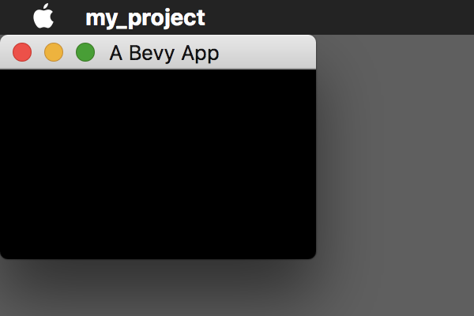

# Initializing A Different Window

The [DefaultPlugins](https://docs.rs/bevy/latest/bevy/struct.DefaultPlugins.html) is a set of plugins.
One of the plugins is the [WindowPlugin](https://docs.rs/bevy/latest/bevy/window/struct.WindowPlugin.html), which defines an interface for windows.
To initialize a window different from the default one, we can change the [WindowPlugin](https://docs.rs/bevy/latest/bevy/window/struct.WindowPlugin.html) by the [set](https://docs.rs/bevy/latest/bevy/app/trait.PluginGroup.html#method.set) method of [DefaultPlugins](https://docs.rs/bevy/latest/bevy/struct.DefaultPlugins.html).

```rust
use bevy::app::PluginGroup;
use bevy::utils::default;
use bevy::window::{Window, WindowPlugin, WindowPosition};
use bevy::{app::App, DefaultPlugins};

fn main() {
    App::new()
        .add_plugins(DefaultPlugins.set(WindowPlugin {
            primary_window: Some(Window {
                title: "A Bevy App".into(),
                position: WindowPosition::At((0, 0).into()),
                resolution: (200., 100.).into(),
                ..default()
            }),
            ..default()
        }))
        .run();
}
```

We set the [primary_window](https://docs.rs/bevy/latest/bevy/window/struct.WindowPlugin.html#structfield.primary_window) field of the [WindowPlugin](https://docs.rs/bevy/latest/bevy/window/struct.WindowPlugin.html) by providing it with the [Window](https://docs.rs/bevy/latest/bevy/window/struct.Window.html) struct and describing the appearance of our window.

The [default](https://docs.rs/bevy/latest/bevy/utils/fn.default.html) function is a syntax sugar for [Default::default](https://doc.rust-lang.org/nightly/core/default/trait.Default.html) in [Bevy](https://bevyengine.org/).

Result:



<!-- :arrow_right:  Next:  -->

:blue_book: Back: [Table of contents](./../README.md)
