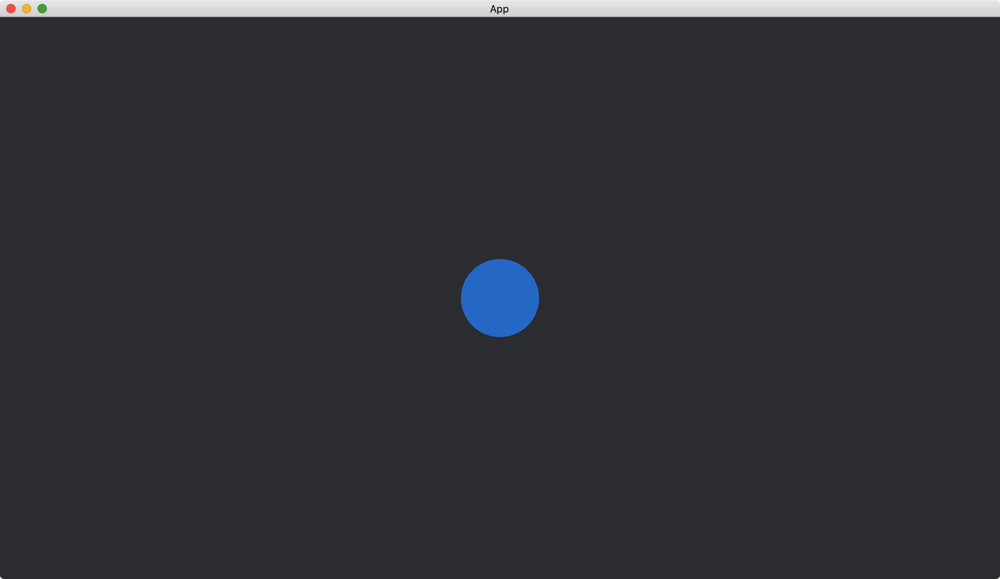

# Keyboard Events

The other method to monitor the keyboard is by [EventReader](https://docs.rs/bevy/latest/bevy/ecs/event/struct.EventReader.html)<[KeyboardInput](https://docs.rs/bevy/latest/bevy/input/keyboard/struct.KeyboardInput.html)>, which is a [SystemParam](https://docs.rs/bevy/latest/bevy/ecs/system/trait.SystemParam.html) that tracks the key events.

```rust
fn handle_keys(
    mut events: EventReader<KeyboardInput>,
    mut my_circle_highlighted: ResMut<MyCircleHighlighted>,
    mut circles: Query<&mut Handle<ColorMaterial>>,
    my_colors: ResMut<MyColors>,
) {
    let mut handle = circles.single_mut();

    for event in events.read() {
        let Some(key_code) = event.key_code else {
            continue;
        };

        if key_code == KeyCode::Space && event.state == ButtonState::Pressed {
            my_circle_highlighted.0 = !my_circle_highlighted.0;
            if my_circle_highlighted.0 {
                *handle = my_colors.color2.clone();
            } else {
                *handle = my_colors.color1.clone();
            }
        }

        println!("In the loop of events.read()");
    }
}
```

We use the method [read()](https://docs.rs/bevy/latest/bevy/ecs/event/struct.EventReader.html#method.read) of [EventReader](https://docs.rs/bevy/latest/bevy/ecs/event/struct.EventReader.html)<[KeyboardInput](https://docs.rs/bevy/latest/bevy/input/keyboard/struct.KeyboardInput.html)> to get the sequence of key events.
Then we can check the detail of a key event, such as its [key_code](https://docs.rs/bevy/latest/bevy/input/keyboard/struct.KeyboardInput.html#structfield.key_code) and its key [state](https://docs.rs/bevy/latest/bevy/input/keyboard/struct.KeyboardInput.html#structfield.state).

The full code is as follows:

```rust
use bevy::{
    app::{App, Startup, Update},
    asset::{Assets, Handle},
    core_pipeline::core_2d::Camera2dBundle,
    ecs::{
        event::EventReader,
        system::{Commands, Query, ResMut, Resource},
    },
    input::{
        keyboard::{KeyCode, KeyboardInput},
        ButtonState,
    },
    render::{
        color::Color,
        mesh::{shape::Circle, Mesh},
    },
    sprite::{ColorMaterial, ColorMesh2dBundle},
    utils::default,
    DefaultPlugins,
};

#[derive(Resource, Default)]
struct MyCircleHighlighted(bool);

#[derive(Resource, Default)]
struct MyColors {
    color1: Handle<ColorMaterial>,
    color2: Handle<ColorMaterial>,
}

fn main() {
    App::new()
        .add_plugins(DefaultPlugins)
        .init_resource::<MyCircleHighlighted>()
        .init_resource::<MyColors>()
        .add_systems(Startup, setup)
        .add_systems(Update, handle_keys)
        .run();
}

fn setup(
    mut commands: Commands,
    mut meshes: ResMut<Assets<Mesh>>,
    mut materials: ResMut<Assets<ColorMaterial>>,
    mut my_colors: ResMut<MyColors>,
) {
    commands.spawn(Camera2dBundle::default());

    my_colors.color1 = materials.add(Color::hsl(210., 1., 0.4).into());
    my_colors.color2 = materials.add(Color::hsl(210., 1., 0.8).into());

    commands.spawn(ColorMesh2dBundle {
        mesh: meshes.add(Circle::new(50.).into()).into(),
        material: my_colors.color1.clone(),
        ..default()
    });
}

fn handle_keys(
    mut events: EventReader<KeyboardInput>,
    mut my_circle_highlighted: ResMut<MyCircleHighlighted>,
    mut circles: Query<&mut Handle<ColorMaterial>>,
    my_colors: ResMut<MyColors>,
) {
    let mut handle = circles.single_mut();

    for event in events.read() {
        let Some(key_code) = event.key_code else {
            continue;
        };

        if key_code == KeyCode::Space && event.state == ButtonState::Pressed {
            my_circle_highlighted.0 = !my_circle_highlighted.0;
            if my_circle_highlighted.0 {
                *handle = my_colors.color2.clone();
            } else {
                *handle = my_colors.color1.clone();
            }
        }

        println!("In the loop of events.read()");
    }
}
```

When the app just starts:



After the key `space` pressed at the first time:


In the code, we print a string in the loop of `events.read()`.
We can see (in the console) that the loop is not executed if there is no key touched.
In some cases, the method of [EventReader](https://docs.rs/bevy/latest/bevy/ecs/event/struct.EventReader.html) is more efficient than the method of [Input](https://docs.rs/bevy/0.12.1/bevy/input/struct.Input.html).

<!-- :arrow_right:  Next:  -->

:blue_book: Back: [Table of contents](./../README.md)
