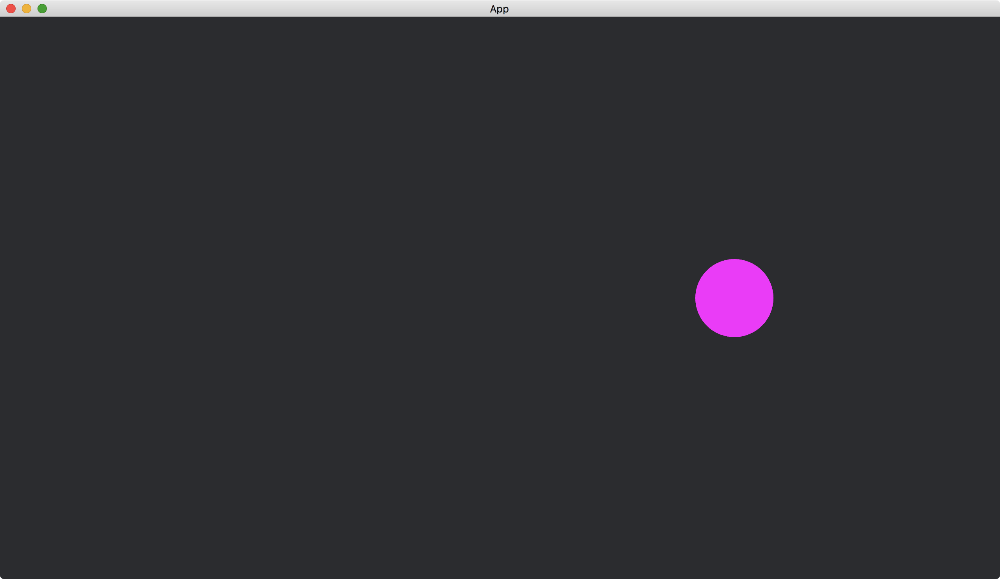

# Keyboard Input

Our app can monitor if a key of the keyboard is pressed or not.

In the following example, we use the key `left` and the key `right` to control a circle.
When `left` is pressed, the circle is moved toward left, and when `right` is pressed, the circle is moved toward right.

We create a resource `MyCirclePositionX` to hold the x position of the circle.

```rust
#[derive(Resource, Default)]
struct MyCirclePositionX(f32);
```

We add a [Circle](https://docs.rs/bevy/0.12.1/bevy/prelude/shape/struct.Circle.html) to our [App](https://docs.rs/bevy/latest/bevy/app/struct.App.html).

```rust
fn setup(mut commands: Commands, mut meshes: ResMut<Assets<Mesh>>) {
    commands.spawn(Camera2dBundle::default());

    commands.spawn(ColorMesh2dBundle {
        mesh: meshes.add(Circle::new(50.).into()).into(),
        ..default()
    });
}
```

When the target keys are pressed, we change the [Transform](https://docs.rs/bevy/latest/bevy/transform/components/struct.Transform.html) of the circle according to the x position stored in `MyCirclePositionX`.

```rust
fn handle_keys(
    keyboard_input: Res<Input<KeyCode>>,
    mut my_circle_pos_x: ResMut<MyCirclePositionX>,
    mut circles: Query<&mut Transform, With<Handle<ColorMaterial>>>,
) {
    let mut transform = circles.single_mut();

    if keyboard_input.pressed(KeyCode::Left) {
        my_circle_pos_x.0 -= 10.;
        *transform = Transform::from_xyz(my_circle_pos_x.0, 0., 0.);
    }

    if keyboard_input.pressed(KeyCode::Right) {
        my_circle_pos_x.0 += 10.;
        *transform = Transform::from_xyz(my_circle_pos_x.0, 0., 0.);
    }
}
```

We use the resource [Input](https://docs.rs/bevy/0.12.1/bevy/input/struct.Input.html)<[KeyCode](https://docs.rs/bevy/latest/bevy/input/keyboard/enum.KeyCode.html)> to get the information of the keyboard.
The method [pressed](https://docs.rs/bevy/0.12.1/bevy/input/struct.Input.html#method.pressed) of `keyboard_input` returns true if the corresponding key is pressed.
Our system `handle_keys` will be executed for each frame update.

The full code is as follows:

```rust
use bevy::{
    app::{App, Startup, Update},
    asset::{Assets, Handle},
    core_pipeline::core_2d::Camera2dBundle,
    ecs::{
        query::With,
        system::{Commands, Query, Res, ResMut, Resource},
    },
    input::{keyboard::KeyCode, Input},
    render::mesh::{shape::Circle, Mesh},
    sprite::{ColorMaterial, ColorMesh2dBundle},
    transform::components::Transform,
    utils::default,
    DefaultPlugins,
};

#[derive(Resource, Default)]
struct MyCirclePositionX(f32);

fn main() {
    App::new()
        .add_plugins(DefaultPlugins)
        .init_resource::<MyCirclePositionX>()
        .add_systems(Startup, setup)
        .add_systems(Update, handle_keys)
        .run();
}

fn setup(mut commands: Commands, mut meshes: ResMut<Assets<Mesh>>) {
    commands.spawn(Camera2dBundle::default());

    commands.spawn(ColorMesh2dBundle {
        mesh: meshes.add(Circle::new(50.).into()).into(),
        ..default()
    });
}

fn handle_keys(
    keyboard_input: Res<Input<KeyCode>>,
    mut my_circle_pos_x: ResMut<MyCirclePositionX>,
    mut circles: Query<&mut Transform, With<Handle<ColorMaterial>>>,
) {
    let mut transform = circles.single_mut();

    if keyboard_input.pressed(KeyCode::Left) {
        my_circle_pos_x.0 -= 10.;
        *transform = Transform::from_xyz(my_circle_pos_x.0, 0., 0.);
    }

    if keyboard_input.pressed(KeyCode::Right) {
        my_circle_pos_x.0 += 10.;
        *transform = Transform::from_xyz(my_circle_pos_x.0, 0., 0.);
    }
}
```

When the app just starts:


After the key `right` pressed for a while:



The resource [Input](https://docs.rs/bevy/0.12.1/bevy/input/struct.Input.html)<[KeyCode](https://docs.rs/bevy/latest/bevy/input/keyboard/enum.KeyCode.html)> also monitors modifier keys such as [ShiftLeft](https://docs.rs/bevy/latest/bevy/input/keyboard/enum.KeyCode.html#variant.ShiftLeft), [ShiftRight](https://docs.rs/bevy/latest/bevy/input/keyboard/enum.KeyCode.html#variant.ShiftRight), [ControlLeft](https://docs.rs/bevy/latest/bevy/input/keyboard/enum.KeyCode.html#variant.ControlLeft), [ControlRight](https://docs.rs/bevy/latest/bevy/input/keyboard/enum.KeyCode.html#variant.ControlRight), etc.

<!-- :arrow_right:  Next:  -->

:blue_book: Back: [Table of contents](./../README.md)
