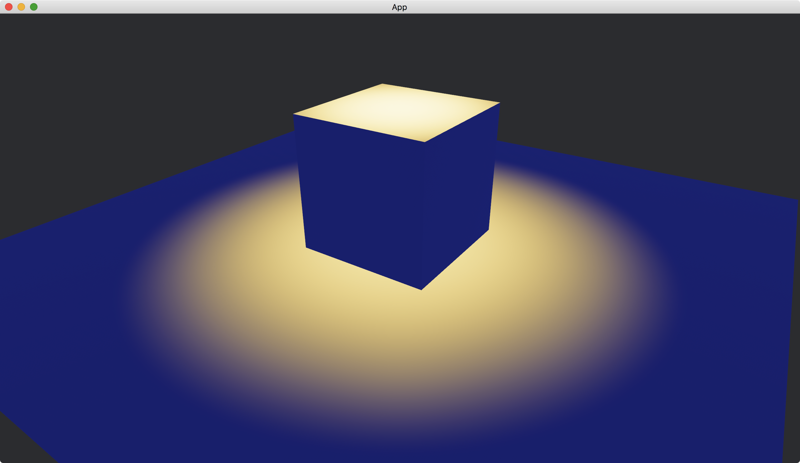

# Light Colors

We can change the color for each kind of lights.

For ambient light, we set [color](https://docs.rs/bevy/latest/bevy/pbr/struct.AmbientLight.html#structfield.color) of [AmbientLight](https://docs.rs/bevy/latest/bevy/pbr/struct.AmbientLight.html).

```rust
commands.insert_resource(AmbientLight {
    brightness: 2.,
    color: Color::GOLD,
});
```

For directional light, we set [color](https://docs.rs/bevy/latest/bevy/pbr/struct.DirectionalLight.html#structfield.color) of [directional_light](https://docs.rs/bevy/latest/bevy/pbr/struct.DirectionalLightBundle.html#structfield.directional_light) of [DirectionalLightBundle](https://docs.rs/bevy/latest/bevy/pbr/struct.DirectionalLightBundle.html).

```rust
commands.spawn(DirectionalLightBundle {
    directional_light: DirectionalLight {
        illuminance: 20000.,
        color: Color::GOLD,
        ..default()
    },
    ..default()
});
```

For point light, we set [color](https://docs.rs/bevy/latest/bevy/pbr/struct.PointLight.html#structfield.color) of [point_light](https://docs.rs/bevy/latest/bevy/pbr/struct.PointLightBundle.html#structfield.point_light) of [PointLightBundle](https://docs.rs/bevy/latest/bevy/pbr/struct.PointLightBundle.html).

```rust
commands.spawn(PointLightBundle {
    point_light: PointLight {
        color: Color::GOLD,
        ..default()
    },
    ..default()
});
```

For spot light, we set [color](https://docs.rs/bevy/latest/bevy/pbr/struct.SpotLight.html#structfield.color) of [spot_light](https://docs.rs/bevy/latest/bevy/pbr/struct.SpotLightBundle.html#structfield.spot_light) of [SpotLightBundle](https://docs.rs/bevy/latest/bevy/pbr/struct.SpotLightBundle.html).

```rust
commands.spawn(SpotLightBundle {
    spot_light: SpotLight {
        color: Color::GOLD,
        ..default()
    },
    ..default()
});
```

In the following example, we combine an ambient light and a spot light where the two lights have different colors.

We place a [Plane](https://docs.rs/bevy/latest/bevy/prelude/shape/struct.Plane.html) to indicate the x-z plane and put a [Cube](https://docs.rs/bevy/latest/bevy/prelude/shape/struct.Cube.html) on it.

The full code is as follows:

```rust
use bevy::{
    app::{App, Startup},
    asset::Assets,
    core_pipeline::core_3d::Camera3dBundle,
    ecs::system::{Commands, ResMut},
    math::Vec3,
    pbr::{AmbientLight, PbrBundle, SpotLight, SpotLightBundle, StandardMaterial},
    render::{
        color::Color,
        mesh::{
            shape::{Cube, Plane},
            Mesh,
        },
    },
    transform::components::Transform,
    utils::default,
    DefaultPlugins,
};

fn main() {
    App::new()
        .add_plugins(DefaultPlugins)
        .add_systems(Startup, setup)
        .run();
}

fn setup(
    mut commands: Commands,
    mut meshes: ResMut<Assets<Mesh>>,
    mut materials: ResMut<Assets<StandardMaterial>>,
) {
    commands.spawn(Camera3dBundle {
        transform: Transform::from_xyz(2., 2., 3.).looking_at(Vec3::ZERO, Vec3::Y),
        ..default()
    });

    commands.spawn(PbrBundle {
        mesh: meshes.add(Cube::new(1.).into()).into(),
        transform: Transform::from_xyz(0., 0.5, 0.),
        material: materials.add(StandardMaterial::default()).into(),
        ..default()
    });

    commands.spawn(PbrBundle {
        mesh: meshes.add(Plane::from_size(5.).into()).into(),
        material: materials.add(StandardMaterial::default()).into(),
        ..default()
    });

    commands.insert_resource(AmbientLight {
        brightness: 2.,
        color: Color::MIDNIGHT_BLUE,
    });

    commands.spawn(SpotLightBundle {
        transform: Transform::from_xyz(0., 2., 0.).looking_at(Vec3::new(0., -1., 0.), Vec3::Z),
        spot_light: SpotLight {
            color: Color::GOLD,
            ..default()
        },
        ..default()
    });
}
```

Result:



<!-- :arrow_right:  Next:  -->

:blue_book: Back: [Table of contents](./../README.md)
