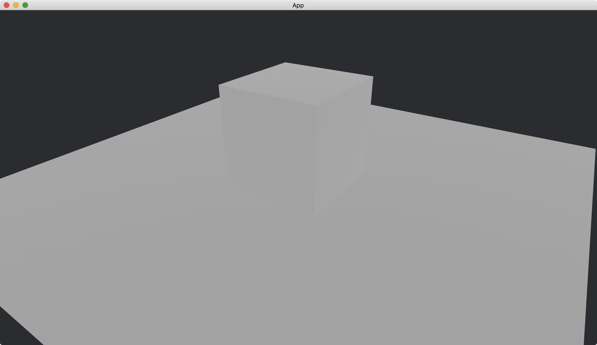
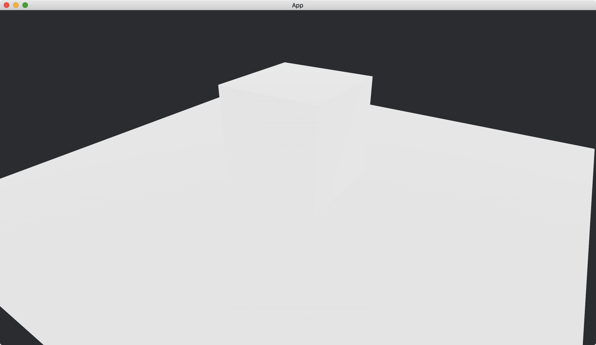
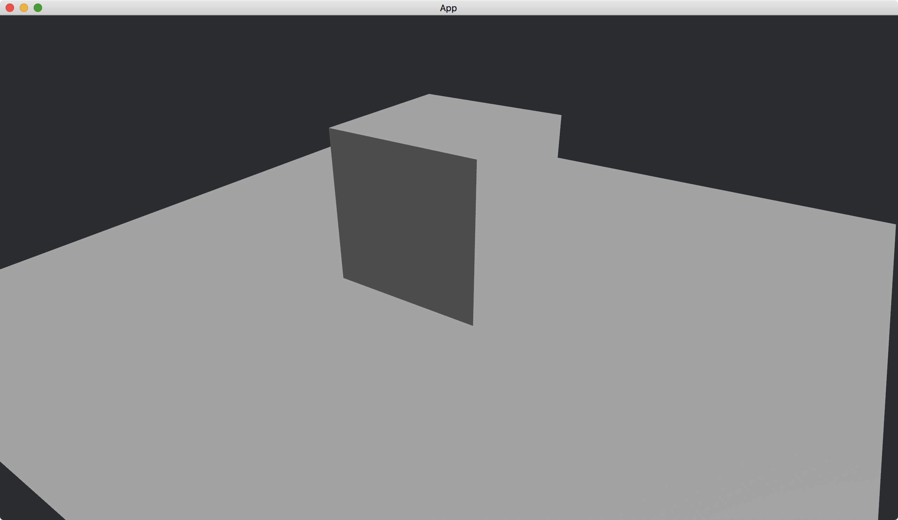
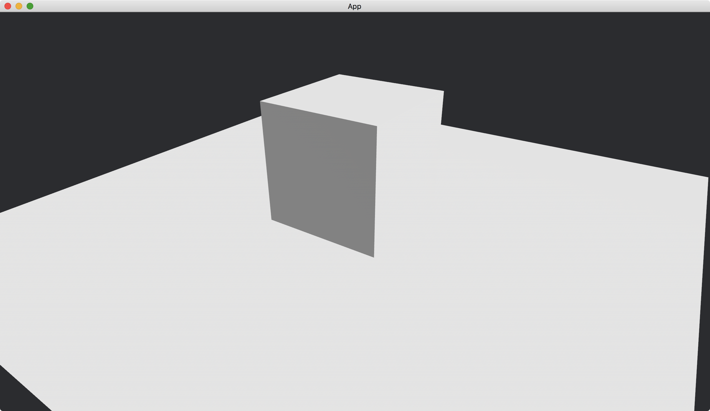
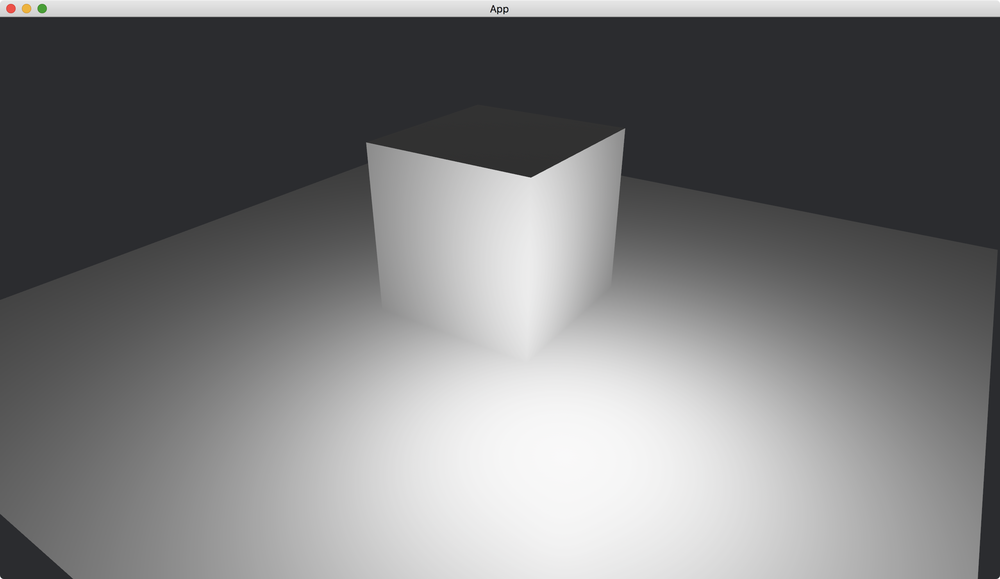
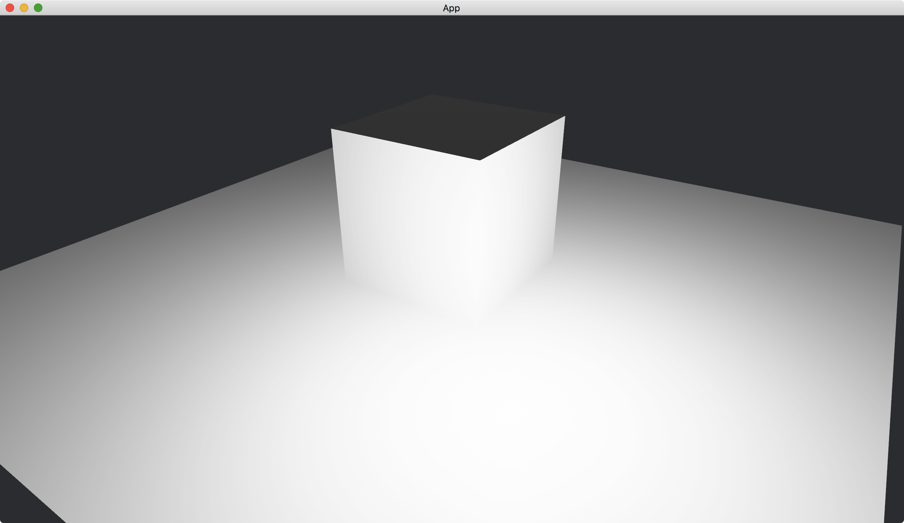
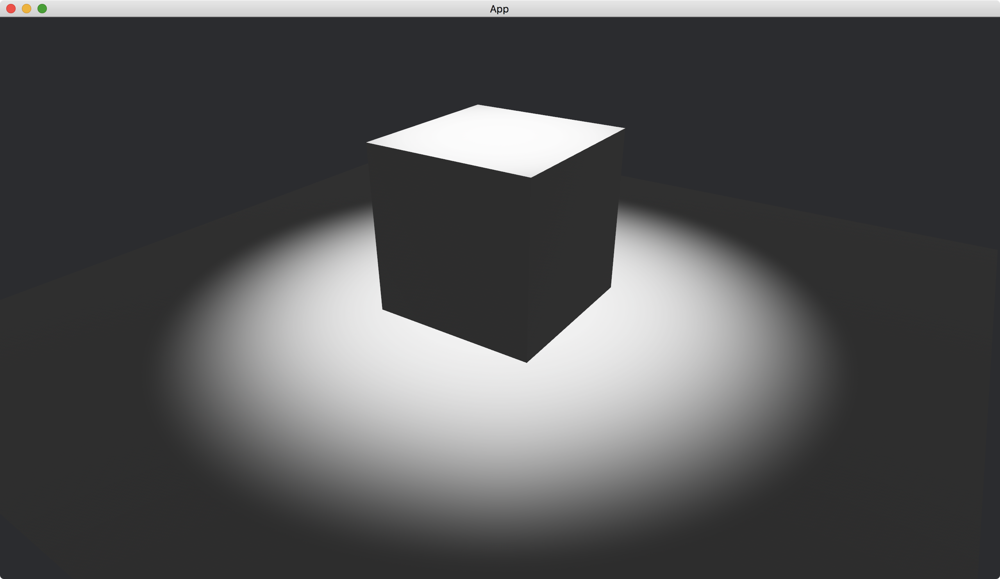
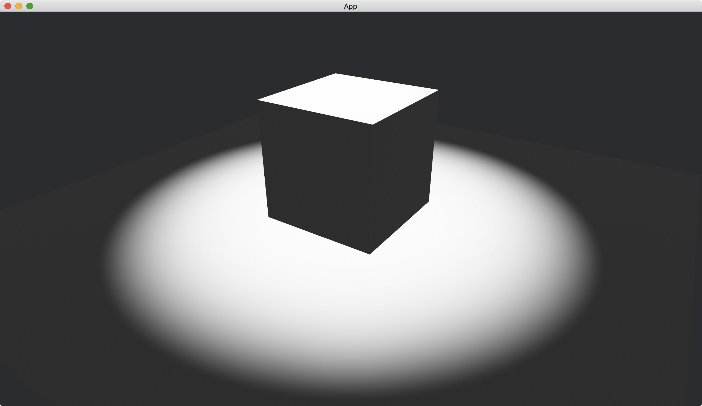

# Light Intensity

We can change the intensity for each kind of lights.
This section gives some sense of intensity values.

For ambient light, we set [brightness](https://docs.rs/bevy/latest/bevy/pbr/struct.AmbientLight.html#structfield.brightness) of [AmbientLight](https://docs.rs/bevy/latest/bevy/pbr/struct.AmbientLight.html).

Ambient light with brightness 1:

Ambient light with brightness 5:

For directional light, we set [illuminance](https://docs.rs/bevy/latest/bevy/pbr/struct.DirectionalLight.html#structfield.illuminance) of [directional_light](https://docs.rs/bevy/latest/bevy/pbr/struct.DirectionalLightBundle.html#structfield.directional_light) of [DirectionalLightBundle](https://docs.rs/bevy/latest/bevy/pbr/struct.DirectionalLightBundle.html).

Directional light with illuminance 10000:

Directional light with illuminance 50000:

For point light, we set [intensity](https://docs.rs/bevy/latest/bevy/pbr/struct.PointLight.html#structfield.intensity) of [point_light](https://docs.rs/bevy/latest/bevy/pbr/struct.PointLightBundle.html#structfield.point_light) of [PointLightBundle](https://docs.rs/bevy/latest/bevy/pbr/struct.PointLightBundle.html).

Point light with intensity 100:

Point light with intensity 500:

For spot light, we set [intensity](https://docs.rs/bevy/latest/bevy/pbr/struct.SpotLight.html#structfield.intensity) of [spot_light](https://docs.rs/bevy/latest/bevy/pbr/struct.SpotLightBundle.html#structfield.spot_light) of [SpotLightBundle](https://docs.rs/bevy/latest/bevy/pbr/struct.SpotLightBundle.html).

Spot light with intensity 1000:

Spot light with intensity 5000:

<!-- :arrow_right:  Next:  -->

:blue_book: Back: [Table of contents](./../README.md)
