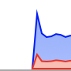
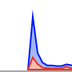

# Low-Power Windows

In the default mode, an [App](https://docs.rs/bevy/latest/bevy/app/struct.App.html) with a window utilizes a lot of CPU power.
This is because the app redraws its window contents repeatedly.
The mode is suitable for game projects.
Yet, for the most of desktop applications, we would like the app to redraw only when there are events occurred.

[Bevy](https://bevyengine.org/) provides such a desktop mode.
We can switch to this mode by replacing a [Resource](https://docs.rs/bevy/latest/bevy/ecs/system/trait.Resource.html).

```rust
use bevy::{app::App, winit::WinitSettings, DefaultPlugins};

fn main() {
    App::new()
        .add_plugins(DefaultPlugins)
        .insert_resource(WinitSettings::desktop_app())
        .run();
}
```

The [DefaultPlugins](https://docs.rs/bevy/latest/bevy/struct.DefaultPlugins.html) contains a [WinitPlugin](https://docs.rs/bevy/latest/bevy/winit/struct.WinitPlugin.html) plugin, which inserts [WinitSettings](https://docs.rs/bevy/latest/bevy/winit/struct.WinitSettings.html) as a [Resource](https://docs.rs/bevy/latest/bevy/ecs/system/trait.Resource.html) for the setting of the [winit](https://crates.io/crates/winit) backend.
The default [WinitSettings](https://docs.rs/bevy/latest/bevy/winit/struct.WinitSettings.html) is [WinitSettings::game()](https://docs.rs/bevy/latest/bevy/winit/struct.WinitSettings.html#method.game).
We replace this setting with [WinitSettings::desktop_app()](https://docs.rs/bevy/latest/bevy/winit/struct.WinitSettings.html#method.desktop_app).
This makes our window utilizes less CPU power as expected.

The [insert_resource](https://docs.rs/bevy/latest/bevy/app/struct.App.html#method.insert_resource) method helps us replacing an existing [Resource](https://docs.rs/bevy/latest/bevy/ecs/system/trait.Resource.html).
The methods add the given [Resource](https://docs.rs/bevy/latest/bevy/ecs/system/trait.Resource.html) when the [Resource](https://docs.rs/bevy/latest/bevy/ecs/system/trait.Resource.html) does not exist in the [App](https://docs.rs/bevy/latest/bevy/app/struct.App.html) and replace the existing [Resource](https://docs.rs/bevy/latest/bevy/ecs/system/trait.Resource.html) if there is any.

When running in default setting ([WinitSettings::game()](https://docs.rs/bevy/latest/bevy/winit/struct.WinitSettings.html#method.game)), the CPU usage would be:



When running in [WinitSettings::desktop_app()](https://docs.rs/bevy/latest/bevy/winit/struct.WinitSettings.html#method.desktop_app), the CPU usage would be:



:arrow_right:  Next: [Closing The Window On Esc Pressed](./closing_the_window_on_esc_pressed.md)

:blue_book: Back: [Table of contents](./../README.md)
