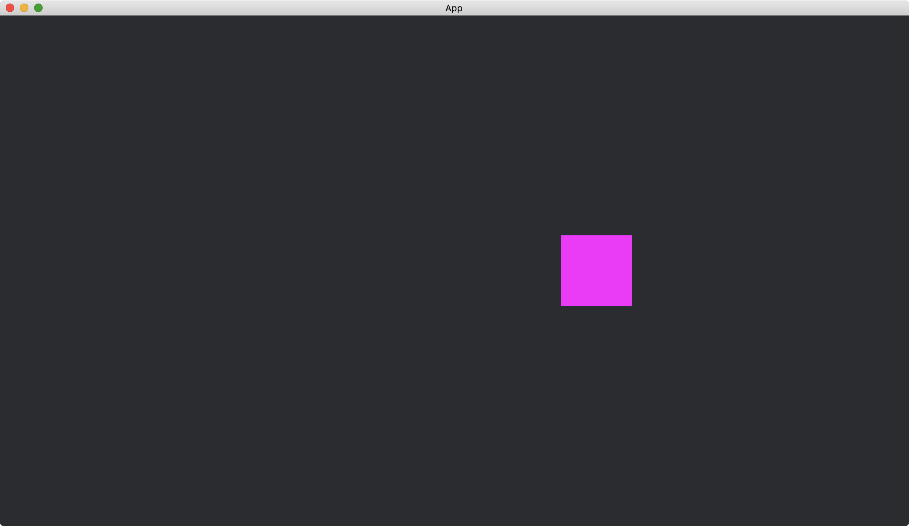

# Monitoring State Transition

In the previous tutorial, when the app is in a state, it executes a system to set the location of a shape.
This system runs repeatedly even if the shape is already in the correct position.
This is not efficient.
Instead, we only need the system to run when a state transition occurs.

In the following example, there are two states: `Circle` and `Rectangle`.
When the app is in state `Circle`, it shows a circle.
And when the app is in state `Rectangle`, it shows a rectangle.

```rust
#[derive(States, Default, Debug, Clone, Eq, PartialEq, Hash)]
enum MyStates {
    #[default]
    Circle,
    Rectangle,
}
```

To do this efficiently, we monitor the state transitions.
When the app enters state `Circle`, it spawns a circle.
when the app enters state `Rectangle`, it spawns a rectangle.
And when the app exits from any of the states, it despawns the existing shape.

The monitoring is done by the schedule label [OnEnter](https://docs.rs/bevy/latest/bevy/ecs/schedule/struct.OnEnter.html) and [OnExit](https://docs.rs/bevy/latest/bevy/ecs/schedule/struct.OnExit.html).

```rust
App::new()
    .add_state::<MyStates>()
    .add_systems(OnEnter(MyStates::Circle), add_circle)
    .add_systems(OnEnter(MyStates::Rectangle), add_rectangle)
    .add_systems(OnExit(MyStates::Circle), remove_shape)
    .add_systems(OnExit(MyStates::Rectangle), remove_shape);
```

Then we use the keyboard to control the state.
When the key `left` is pressed, we change the state to `MyStates:;Circle`.
And when the key `right` is pressed, we change the state to `MyStates:;Rectangle`.

The full code is as follows:

```rust
use bevy::{
    app::{App, Startup, Update},
    asset::{Assets, Handle},
    core_pipeline::core_2d::Camera2dBundle,
    ecs::{
        entity::Entity,
        query::With,
        schedule::{NextState, OnEnter, OnExit, States},
        system::{Commands, Query, Res, ResMut},
    },
    input::{keyboard::KeyCode, Input},
    render::mesh::{
        shape::{Circle, Quad},
        Mesh,
    },
    sprite::{ColorMaterial, ColorMesh2dBundle},
    transform::components::Transform,
    utils::default,
    DefaultPlugins,
};

#[derive(States, Default, Debug, Clone, Eq, PartialEq, Hash)]
enum MyStates {
    #[default]
    Circle,
    Rectangle,
}

fn main() {
    App::new()
        .add_plugins(DefaultPlugins)
        .add_state::<MyStates>()
        .add_systems(Startup, setup)
        .add_systems(Update, handle_keys)
        .add_systems(OnEnter(MyStates::Circle), add_circle)
        .add_systems(OnEnter(MyStates::Rectangle), add_rectangle)
        .add_systems(OnExit(MyStates::Circle), remove_shape)
        .add_systems(OnExit(MyStates::Rectangle), remove_shape)
        .run();
}

fn setup(mut commands: Commands) {
    commands.spawn(Camera2dBundle::default());
}

fn handle_keys(keyboard_input: Res<Input<KeyCode>>, mut next_state: ResMut<NextState<MyStates>>) {
    if keyboard_input.pressed(KeyCode::Left) {
        next_state.set(MyStates::Circle);
    }

    if keyboard_input.pressed(KeyCode::Right) {
        next_state.set(MyStates::Rectangle);
    }
}

fn add_circle(mut commands: Commands, mut meshes: ResMut<Assets<Mesh>>) {
    commands.spawn(ColorMesh2dBundle {
        mesh: meshes.add(Circle::new(50.).into()).into(),
        transform: Transform::from_xyz(-200., 0., 0.),
        ..default()
    });
}

fn add_rectangle(mut commands: Commands, mut meshes: ResMut<Assets<Mesh>>) {
    commands.spawn(ColorMesh2dBundle {
        mesh: meshes.add(Quad::new((100., 100.).into()).into()).into(),
        transform: Transform::from_xyz(200., 0., 0.),
        ..default()
    });
}

fn remove_shape(mut commands: Commands, shapes: Query<Entity, With<Handle<ColorMaterial>>>) {
    for id in &shapes {
        commands.entity(id).despawn();
    }
}
```

When the key `left` is pressed:


When the key `right` is pressed:



By running the program, we can also see that the app enters the default state automatically.
At the start of running the app, the circle is shown even if we have not pressed any keys.

In addition to the two schedule labels, we can use [OnTransition](https://docs.rs/bevy/latest/bevy/ecs/schedule/struct.OnTransition.html) to specify the exiting state and the entering state.
The corresponding system will only be executed on the specified state transition.

<!-- :arrow_right:  Next:  -->

:blue_book: Back: [Table of contents](./../README.md)
