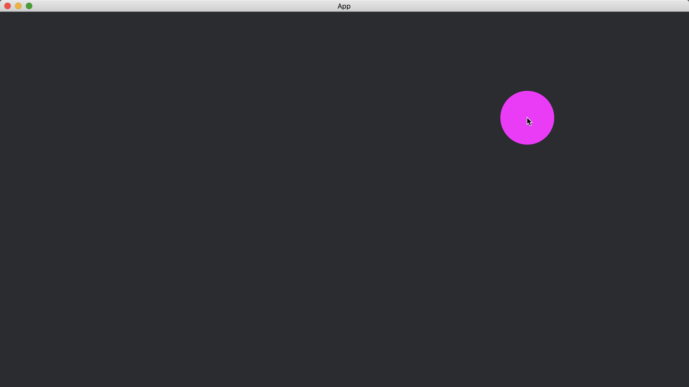

# Mouse Events

To capture other mouse information, we can use [EventReader](https://docs.rs/bevy/latest/bevy/ecs/event/struct.EventReader.html).
For example, we can use [EventReader](https://docs.rs/bevy/latest/bevy/ecs/event/struct.EventReader.html)<[CursorMoved](https://docs.rs/bevy/latest/bevy/window/struct.CursorMoved.html)> to monitor the mouse position on the window.

In the following example, we create a [Circle](https://docs.rs/bevy/0.12.1/bevy/prelude/shape/struct.Circle.html) that follows the mouse pointer.

```rust
fn handle_keys(
    mut events: EventReader<CursorMoved>,
    mut circles: Query<&mut Transform, With<Handle<ColorMaterial>>>,
) {
    let mut transform = circles.single_mut();

    for event in events.read() {
        *transform = Transform::from_xyz(
            event.position.x - 1280. / 2.,
            -event.position.y + 720. / 2.,
            0.,
        );
    }
}
```

The code `event.position.x - 1280. / 2.` and `-event.position.y + 720. / 2.` converts the mouse x and y positions to the space of [Camera](https://docs.rs/bevy/latest/bevy/render/camera/struct.Camera.html).
This is done by assuming the window has size `1280 x 720`.

The full code is as follows:

```rust
use bevy::{
    app::{App, Startup, Update},
    asset::{Assets, Handle},
    core_pipeline::core_2d::Camera2dBundle,
    ecs::{
        event::EventReader,
        query::With,
        system::{Commands, Query, ResMut},
    },
    render::mesh::{shape::Circle, Mesh},
    sprite::{ColorMaterial, ColorMesh2dBundle},
    transform::components::Transform,
    utils::default,
    window::CursorMoved,
    DefaultPlugins,
};

fn main() {
    App::new()
        .add_plugins(DefaultPlugins)
        .add_systems(Startup, setup)
        .add_systems(Update, handle_keys)
        .run();
}

fn setup(mut commands: Commands, mut meshes: ResMut<Assets<Mesh>>) {
    commands.spawn(Camera2dBundle::default());

    commands.spawn(ColorMesh2dBundle {
        mesh: meshes.add(Circle::new(50.).into()).into(),
        ..default()
    });
}

fn handle_keys(
    mut events: EventReader<CursorMoved>,
    mut circles: Query<&mut Transform, With<Handle<ColorMaterial>>>,
) {
    let mut transform = circles.single_mut();

    for event in events.read() {
        *transform = Transform::from_xyz(
            event.position.x - 1280. / 2.,
            -event.position.y + 720. / 2.,
            0.,
        );
    }
}
```

Result:



In addition to [CursorMoved](https://docs.rs/bevy/latest/bevy/window/struct.CursorMoved.html), there are other mouse-related [Event](https://docs.rs/bevy/latest/bevy/ecs/event/trait.Event.html)s that we can use along with [EventReader](https://docs.rs/bevy/latest/bevy/ecs/event/struct.EventReader.html) such as [MouseButtonInput](https://docs.rs/bevy/latest/bevy/input/mouse/struct.MouseButtonInput.html), [MouseMotion](https://docs.rs/bevy/latest/bevy/input/mouse/struct.MouseMotion.html), [MouseWheel](https://docs.rs/bevy/latest/bevy/input/mouse/struct.MouseWheel.html), etc.

<!-- :arrow_right:  Next:  -->

:blue_book: Back: [Table of contents](./../README.md)
