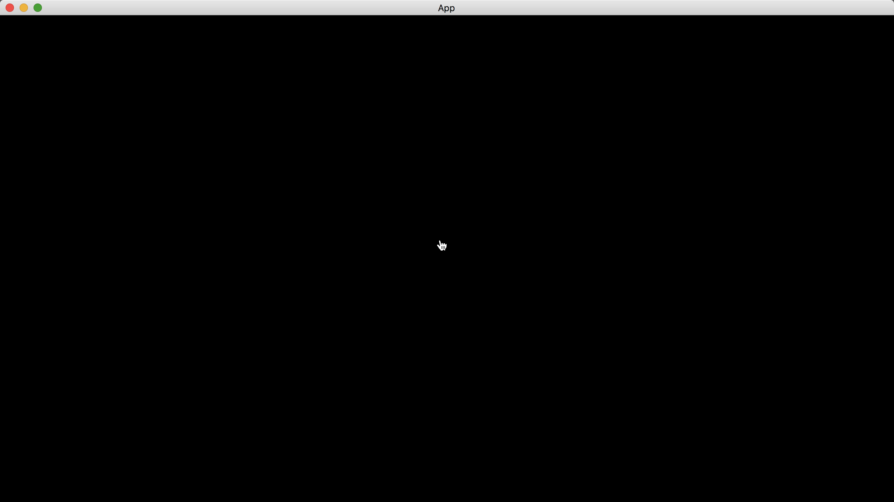

# Mouse Icon

We can change the mouse icon by the component [Window](https://docs.rs/bevy/latest/bevy/window/struct.Window.html).

```rust
use bevy::{
    app::{App, Startup},
    ecs::system::Query,
    window::{CursorIcon, Window},
    DefaultPlugins,
};

fn main() {
    App::new()
        .add_plugins(DefaultPlugins)
        .add_systems(Startup, setup)
        .run();
}

fn setup(mut windows: Query<&mut Window>) {
    let mut window = windows.single_mut();

    window.cursor.icon = CursorIcon::Hand;
}
```

We change the mouse icon by specifying `window.cursor.icon`.

Result:



<!-- :arrow_right:  Next:  -->

:blue_book: Back: [Table of contents](./../README.md)
