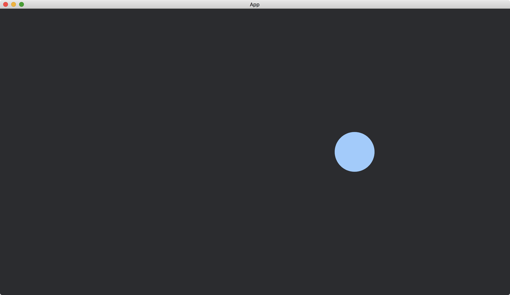

# Mouse Input

We can also use the resource [Input](https://docs.rs/bevy/0.12.1/bevy/input/struct.Input.html) to monitor mouse button states.

In the following example, we create a [Circle](https://docs.rs/bevy/0.12.1/bevy/prelude/shape/struct.Circle.html) in our app.
When we left-click the mouse, the circle moves.
And when we right-click the mouse, the circle changes its color.

To do so, we use a resource `MyCircleInfo` to store the circle's position and its color indication.

```rust
#[derive(Resource, Default)]
struct MyCircleInfo {
    position_x: f32,
    highlighted: bool,
}
```

We use the resource [Input](https://docs.rs/bevy/0.12.1/bevy/input/struct.Input.html)<[MouseButton](https://docs.rs/bevy/latest/bevy/input/mouse/enum.MouseButton.html)> to monitor the mouse button states.
We also use the method [pressed](https://docs.rs/bevy/0.12.1/bevy/input/struct.Input.html#method.pressed) and the method [just_pressed](https://docs.rs/bevy/0.12.1/bevy/input/struct.Input.html#method.just_pressed) of [Input](https://docs.rs/bevy/0.12.1/bevy/input/struct.Input.html) to check if a mouse button is pressed.

```rust
fn handle_mouse(
    mouse_input: Res<Input<MouseButton>>,
    mut my_circle_info: ResMut<MyCircleInfo>,
    mut circles: Query<(&mut Transform, &mut Handle<ColorMaterial>)>,
    my_colors: ResMut<MyColors>,
) {
    let (mut transform, mut handle) = circles.single_mut();

    if mouse_input.pressed(MouseButton::Left) {
        my_circle_info.position_x += 10.;
        *transform = Transform::from_xyz(my_circle_info.position_x, 0., 0.);
    }

    if mouse_input.just_pressed(MouseButton::Right) {
        my_circle_info.highlighted = !my_circle_info.highlighted;
        if my_circle_info.highlighted {
            *handle = my_colors.color2.clone();
        } else {
            *handle = my_colors.color1.clone();
        }
    }
}
```

The full code is as follows:

```rust
use bevy::{
    app::{App, Startup, Update},
    asset::{Assets, Handle},
    core_pipeline::core_2d::Camera2dBundle,
    ecs::system::{Commands, Query, Res, ResMut, Resource},
    input::{mouse::MouseButton, Input},
    render::{
        color::Color,
        mesh::{shape::Circle, Mesh},
    },
    sprite::{ColorMaterial, ColorMesh2dBundle},
    transform::components::Transform,
    utils::default,
    DefaultPlugins,
};

#[derive(Resource, Default)]
struct MyCircleInfo {
    position_x: f32,
    highlighted: bool,
}

#[derive(Resource, Default)]
struct MyColors {
    color1: Handle<ColorMaterial>,
    color2: Handle<ColorMaterial>,
}

fn main() {
    App::new()
        .add_plugins(DefaultPlugins)
        .init_resource::<MyCircleInfo>()
        .init_resource::<MyColors>()
        .add_systems(Startup, setup)
        .add_systems(Update, handle_mouse)
        .run();
}

fn setup(
    mut commands: Commands,
    mut meshes: ResMut<Assets<Mesh>>,
    mut materials: ResMut<Assets<ColorMaterial>>,
    mut my_colors: ResMut<MyColors>,
) {
    commands.spawn(Camera2dBundle::default());

    my_colors.color1 = materials.add(Color::hsl(210., 1., 0.4).into());
    my_colors.color2 = materials.add(Color::hsl(210., 1., 0.8).into());

    commands.spawn(ColorMesh2dBundle {
        mesh: meshes.add(Circle::new(50.).into()).into(),
        material: my_colors.color1.clone(),
        ..default()
    });
}

fn handle_mouse(
    mouse_input: Res<Input<MouseButton>>,
    mut my_circle_info: ResMut<MyCircleInfo>,
    mut circles: Query<(&mut Transform, &mut Handle<ColorMaterial>)>,
    my_colors: ResMut<MyColors>,
) {
    let (mut transform, mut handle) = circles.single_mut();

    if mouse_input.pressed(MouseButton::Left) {
        my_circle_info.position_x += 10.;
        *transform = Transform::from_xyz(my_circle_info.position_x, 0., 0.);
    }

    if mouse_input.just_pressed(MouseButton::Right) {
        my_circle_info.highlighted = !my_circle_info.highlighted;
        if my_circle_info.highlighted {
            *handle = my_colors.color2.clone();
        } else {
            *handle = my_colors.color1.clone();
        }
    }
}
```

When the app just started:


After the left mouse button pressed for a while:


After the right mouse button just pressed at the first time:



We can use the method [just_released](https://docs.rs/bevy/0.12.1/bevy/input/struct.Input.html#method.just_released) to monitor the released state of a mouse button.

:arrow_right:  Next: [Mouse Events](./mouse_events.md)

:blue_book: Back: [Table of contents](./../README.md)
