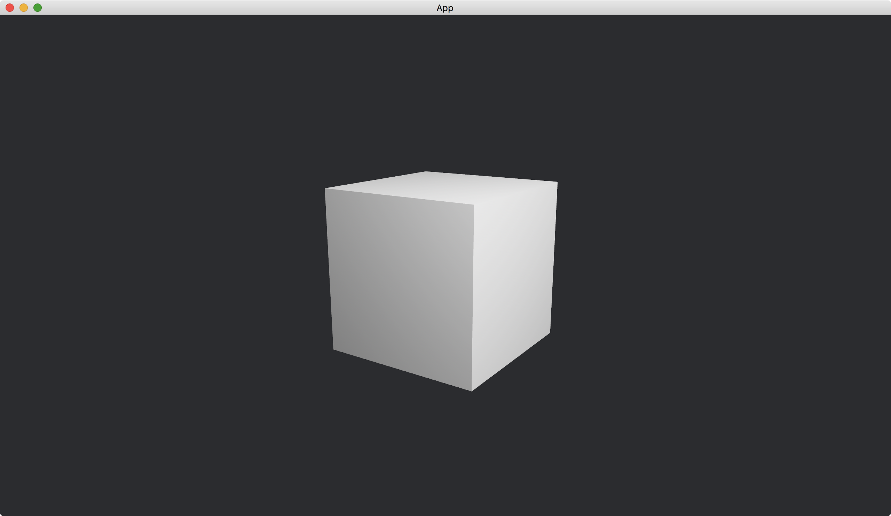
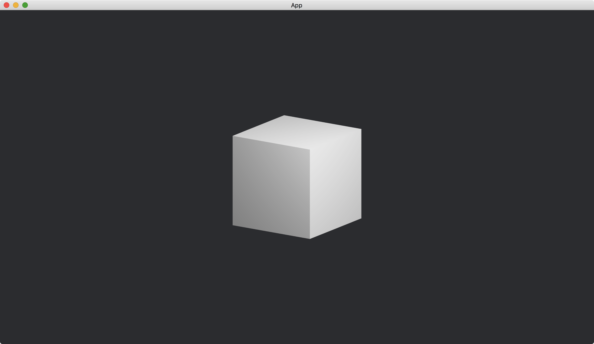
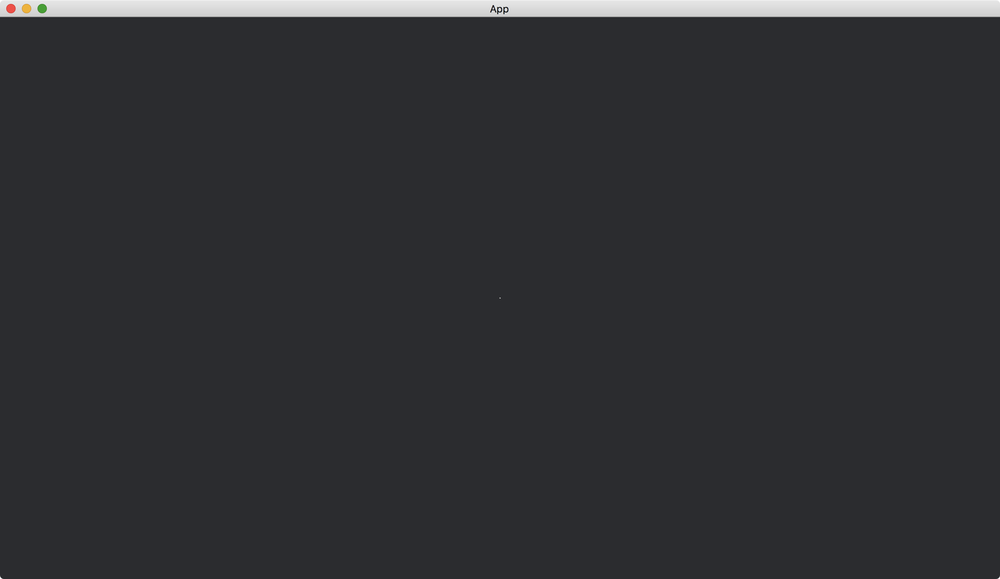

# Orthographic View

The default [Camera3dBundle](https://docs.rs/bevy/latest/bevy/core_pipeline/core_3d/struct.Camera3dBundle.html) has a property that objects near the camera are larger and objects far away from the camera are smaller.



This may not be wanted for some engineering problems, which require objects with the same size look the same no matter the distances between them and the camera.



This can be done by modifying the [projection](https://docs.rs/bevy/latest/bevy/core_pipeline/core_3d/struct.Camera3dBundle.html#structfield.projection) of [Camera3dBundle](https://docs.rs/bevy/latest/bevy/core_pipeline/core_3d/struct.Camera3dBundle.html).

```rust
commands.spawn(Camera3dBundle {
    transform: Transform::from_xyz(2., 1., 3.).looking_at(Vec3::ZERO, Vec3::Y),
    projection: Projection::Orthographic(OrthographicProjection {
        scaling_mode: ScalingMode::WindowSize(200.),
        ..default()
    }),
    ..default()
});
```

We set the [projection](https://docs.rs/bevy/latest/bevy/core_pipeline/core_3d/struct.Camera3dBundle.html#structfield.projection) to [Projection::Orthographic](https://docs.rs/bevy/latest/bevy/render/camera/enum.Projection.html#variant.Orthographic) and pass an [OrthographicProjection](https://docs.rs/bevy/latest/bevy/render/camera/struct.OrthographicProjection.html) to it.
In the [OrthographicProjection](https://docs.rs/bevy/latest/bevy/render/camera/struct.OrthographicProjection.html), we set the [scaling_mode](https://docs.rs/bevy/latest/bevy/render/camera/struct.OrthographicProjection.html#structfield.scaling_mode) to specify the size of one unit on the screen.
In our case, we specify `ScalingMode::WindowSize(200.)`, which maps one unit in the 3D space to 200 units (usually pixels) in the window.

The full code is as follows:

```rust
use bevy::{
    app::{App, Startup},
    asset::Assets,
    core_pipeline::core_3d::Camera3dBundle,
    ecs::system::{Commands, ResMut},
    math::Vec3,
    pbr::{PbrBundle, PointLightBundle, StandardMaterial},
    render::{camera::{OrthographicProjection, Projection, ScalingMode}, mesh::{shape::Cube, Mesh}},
    transform::components::Transform,
    utils::default,
    DefaultPlugins,
};

fn main() {
    App::new()
        .add_plugins(DefaultPlugins)
        .add_systems(Startup, setup)
        .run();
}

fn setup(
    mut commands: Commands,
    mut meshes: ResMut<Assets<Mesh>>,
    mut materials: ResMut<Assets<StandardMaterial>>,
) {
    commands.spawn(Camera3dBundle {
        transform: Transform::from_xyz(2., 1., 3.).looking_at(Vec3::ZERO, Vec3::Y),
        projection: Projection::Orthographic(OrthographicProjection {
            scaling_mode: ScalingMode::WindowSize(200.),
            ..default()
        }),
        ..default()
    });

    commands.spawn(PbrBundle {
        mesh: meshes.add(Cube::new(1.).into()).into(),
        material: materials.add(StandardMaterial::default()).into(),
        ..default()
    });

    commands.spawn(PointLightBundle {
        transform: Transform::from_xyz(2., 2., 1.),
        ..default()
    });
}
```

The result is shown by the second picture above.

If we use the default [ScalingMode](https://docs.rs/bevy/latest/bevy/render/camera/enum.ScalingMode.html), the scene will be very small, since one unit in the 3D space maps to 1 unit in the window.



The cube becomes a small white point at the center of the window.

:arrow_right:  Next: [Cube](./cube.md)

:blue_book: Back: [Table of contents](./../README.md)
