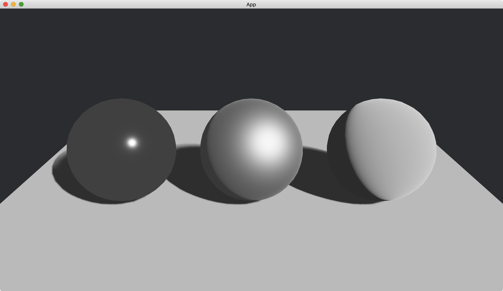

# Perceptual Roughness

For each metal object in our 3D scene, we can see a highlight.
The range of this highlight can be controlled.

We use [perceptual_roughness](https://docs.rs/bevy/latest/bevy/pbr/struct.StandardMaterial.html#structfield.perceptual_roughness) of [StandardMaterial](https://docs.rs/bevy/latest/bevy/pbr/struct.StandardMaterial.html) to control the range of highlight.

```rust
commands.spawn(PbrBundle {
    material: materials.add(StandardMaterial {
        perceptual_roughness: 1.,
        ..default()
    }),
    ..default()
});
```

The value of [perceptual_roughness](https://docs.rs/bevy/latest/bevy/pbr/struct.StandardMaterial.html#structfield.perceptual_roughness) is between `0.089` and `1`.
The larger the value, the larger the range of highlight.

In the following example, we create three spheres.
From the left to right, their [perceptual_roughness](https://docs.rs/bevy/latest/bevy/pbr/struct.StandardMaterial.html#structfield.perceptual_roughness) are `0.089`, `0.5` and `1` respectively.
To make the difference obvious, we set all [metallic](https://docs.rs/bevy/latest/bevy/pbr/struct.StandardMaterial.html#structfield.metallic) to `1`.

The full code is as follows:

```rust
use bevy::{
    app::{App, Startup},
    asset::Assets,
    core_pipeline::core_3d::Camera3dBundle,
    ecs::system::{Commands, ResMut},
    math::Vec3,
    pbr::{DirectionalLight, DirectionalLightBundle, PbrBundle, StandardMaterial},
    render::mesh::{
        shape::{Plane, UVSphere},
        Mesh,
    },
    transform::components::Transform,
    utils::default,
    DefaultPlugins,
};

fn main() {
    App::new()
        .add_plugins(DefaultPlugins)
        .add_systems(Startup, setup)
        .run();
}

fn setup(
    mut commands: Commands,
    mut meshes: ResMut<Assets<Mesh>>,
    mut materials: ResMut<Assets<StandardMaterial>>,
) {
    commands.spawn(Camera3dBundle {
        transform: Transform::from_xyz(0., 2., 3.).looking_at(Vec3::new(0., 0.5, 0.), Vec3::Y),
        ..default()
    });

    // left
    commands.spawn(PbrBundle {
        mesh: meshes.add(
            UVSphere {
                radius: 0.5,
                ..default()
            }
            .into(),
        ),
        material: materials.add(StandardMaterial {
            perceptual_roughness: 0.089,
            metallic: 1.,
            ..default()
        }),
        transform: Transform::from_xyz(-1.25, 0.5, 0.),
        ..default()
    });

    // middle
    commands.spawn(PbrBundle {
        mesh: meshes.add(
            UVSphere {
                radius: 0.5,
                ..default()
            }
            .into(),
        ),
        material: materials.add(StandardMaterial {
            perceptual_roughness: 0.5,
            metallic: 1.,
            ..default()
        }),
        transform: Transform::from_xyz(0., 0.5, 0.),
        ..default()
    });

    // right
    commands.spawn(PbrBundle {
        mesh: meshes.add(
            UVSphere {
                radius: 0.5,
                ..default()
            }
            .into(),
        ),
        material: materials.add(StandardMaterial {
            perceptual_roughness: 1.,
            metallic: 1.,
            ..default()
        }),
        transform: Transform::from_xyz(1.25, 0.5, 0.),
        ..default()
    });

    commands.spawn(PbrBundle {
        mesh: meshes.add(Plane::from_size(5.).into()),
        material: materials.add(StandardMaterial::default()),
        ..default()
    });

    commands.spawn(DirectionalLightBundle {
        directional_light: DirectionalLight {
            illuminance: 20000.,
            shadows_enabled: true,
            ..default()
        },
        transform: Transform::default().looking_to(Vec3::new(-1., -1., -1.), Vec3::Y),
        ..default()
    });
}
```

Result:



:arrow_right:  Next: [Diffuse Transmission](./diffuse_transmission.md)

:blue_book: Back: [Table of contents](./../README.md)
