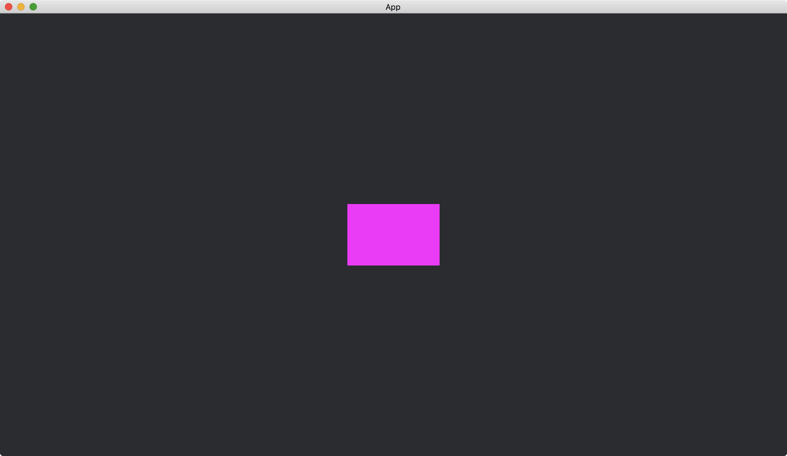

# Quads

In addition to [Circle](https://docs.rs/bevy/latest/bevy/prelude/shape/struct.Circle.html), we can add rectangles to our app.
A rectangle in [Bevy](https://bevyengine.org/) is called a [Quad](https://docs.rs/bevy/latest/bevy/prelude/shape/struct.Quad.html).

```rust
use bevy::{
    app::{App, Startup},
    asset::Assets,
    core_pipeline::core_2d::Camera2dBundle,
    ecs::system::{Commands, ResMut},
    prelude::default,
    render::mesh::{shape::Quad, Mesh},
    sprite::ColorMesh2dBundle,
    DefaultPlugins,
};

fn main() {
    App::new()
        .add_plugins(DefaultPlugins)
        .add_systems(Startup, setup)
        .run();
}

fn setup(mut commands: Commands, mut meshes: ResMut<Assets<Mesh>>) {
    commands.spawn(Camera2dBundle::default());

    commands.spawn(ColorMesh2dBundle {
        mesh: meshes.add(Quad::new((150., 100.).into()).into()).into(),
        ..default()
    });
}
```

The function [Quad::new](https://docs.rs/bevy/latest/bevy/prelude/shape/struct.Quad.html#method.new) accepts a [Vec2](https://docs.rs/bevy/latest/bevy/math/struct.Vec2.html), which defines the width and the height of the [Quad](https://docs.rs/bevy/latest/bevy/prelude/shape/struct.Quad.html).

Result:



<!-- :arrow_right:  Next:  -->

:blue_book: Back: [Table of contents](./../README.md)
