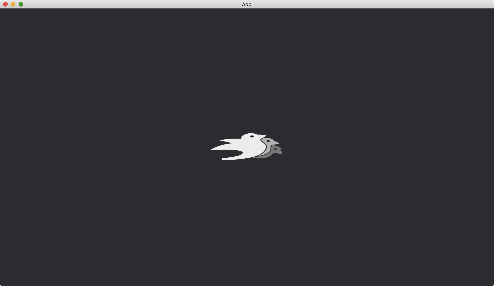
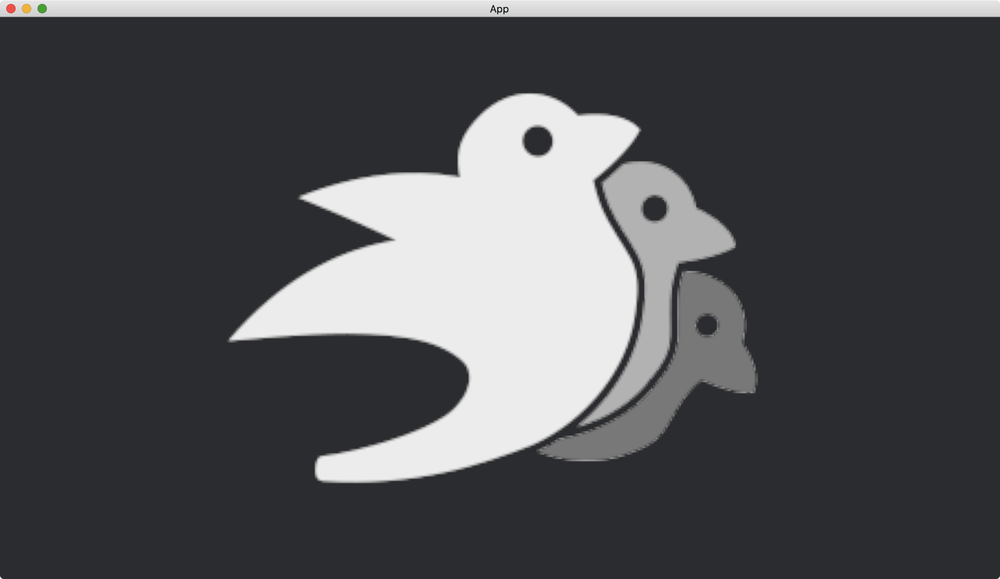

# Resizing Images

In default, the [SpriteBundle](https://docs.rs/bevy/latest/bevy/sprite/struct.SpriteBundle.html) displays the loaded [Image](https://docs.rs/bevy/latest/bevy/render/texture/struct.Image.html) in its original size.
We can change the size by [SpriteBundle](https://docs.rs/bevy/latest/bevy/sprite/struct.SpriteBundle.html)'s [Sprite](https://docs.rs/bevy/latest/bevy/sprite/struct.Sprite.html) component.
More precisely, we set the [custom_size](https://docs.rs/bevy/latest/bevy/sprite/struct.Sprite.html#structfield.custom_size) of the [Sprite](https://docs.rs/bevy/latest/bevy/sprite/struct.Sprite.html) component.

```rust
fn change_image_size(mut sprites: Query<&mut Sprite>) {
    let mut sprite = sprites.single_mut();

    sprite.custom_size = Some((200., 100.).into());
}
```

The full code is as follows:

```rust
use bevy::{
    app::{App, Startup, Update},
    asset::AssetServer,
    core_pipeline::core_2d::Camera2dBundle,
    ecs::system::{Commands, Query, Res},
    sprite::{Sprite, SpriteBundle},
    utils::default,
    DefaultPlugins,
};

fn main() {
    App::new()
        .add_plugins(DefaultPlugins)
        .add_systems(Startup, setup)
        .add_systems(Update, change_image_size)
        .run();
}

fn setup(mut commands: Commands, asset_server: Res<AssetServer>) {
    commands.spawn(Camera2dBundle::default());

    commands.spawn(SpriteBundle {
        texture: asset_server.load("bevy_bird_dark.png"),
        ..default()
    });
}

fn change_image_size(mut sprites: Query<&mut Sprite>) {
    let mut sprite = sprites.single_mut();

    sprite.custom_size = Some((200., 100.).into());
}
```

Result:



Combined with the [Window](https://docs.rs/bevy/latest/bevy/window/struct.Window.html) component we introduced before, we can make the image to fit the window.
In the following code, we make the image to fit the window height.

```rust
fn change_image_size(mut sprites: Query<&mut Sprite>, windows: Query<&Window>) {
    let mut sprite = sprites.single_mut();

    let window = windows.single();
    let height = window.height();

    sprite.custom_size = Some((height, height).into());
}
```

Result:



:arrow_right:  Next: [Translation](./translation.md)

:blue_book: Back: [Table of contents](./../README.md)
