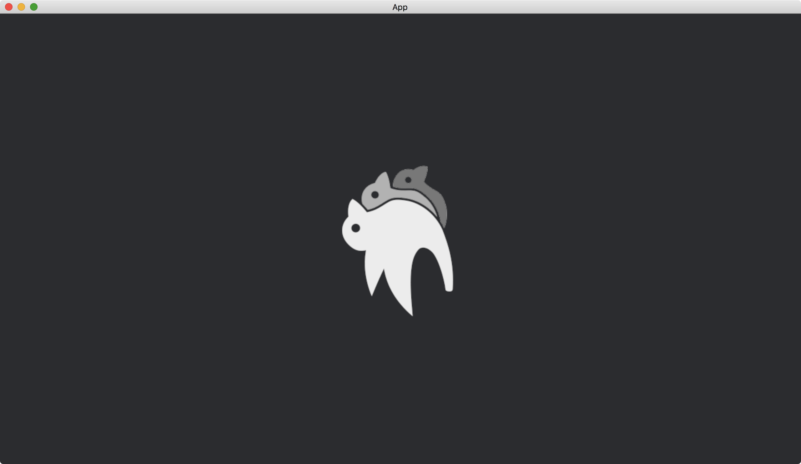

# Rotation

In addition to move an image, [Transform](https://docs.rs/bevy/latest/bevy/transform/components/struct.Transform.html) is also able to rotate an image.
We can use the function [Transform::from_rotation](https://docs.rs/bevy/latest/bevy/transform/components/struct.Transform.html#method.from_rotation) to rotate the image.
The function receives a struct [Quat](https://docs.rs/bevy/latest/bevy/math/f32/struct.Quat.html), which describes how to rotate an object.

```rust
fn setup(mut commands: Commands, asset_server: Res<AssetServer>) {
    commands.spawn(Camera2dBundle::default());

    commands.spawn(SpriteBundle {
        texture: asset_server.load("bevy_bird_dark.png"),
        transform: Transform::from_rotation(Quat::from_rotation_z(1.57)),
        ..default()
    });
}
```

The function [Quat::from_rotation_z](https://docs.rs/bevy/latest/bevy/math/f32/struct.Quat.html#method.from_rotation_z) rotates objects based on the z axis, resulting in the objects rotated on the x-y plane.
Its parameter describes the angle of the rotation.
The angle is in radians and is for counter-clockwise rotations when the angle is positive.

The full code is as follows:

```rust
use bevy::{
    app::{App, Startup},
    asset::AssetServer,
    core_pipeline::core_2d::Camera2dBundle,
    ecs::system::{Commands, Res},
    math::Quat,
    sprite::SpriteBundle,
    transform::components::Transform,
    utils::default,
    DefaultPlugins,
};

fn main() {
    App::new()
        .add_plugins(DefaultPlugins)
        .add_systems(Startup, setup)
        .run();
}

fn setup(mut commands: Commands, asset_server: Res<AssetServer>) {
    commands.spawn(Camera2dBundle::default());

    commands.spawn(SpriteBundle {
        texture: asset_server.load("bevy_bird_dark.png"),
        transform: Transform::from_rotation(Quat::from_rotation_z(1.57)),
        ..default()
    });
}
```

Result:



:arrow_right:  Next: [Scale](./scale.md)

:blue_book: Back: [Table of contents](./../README.md)
