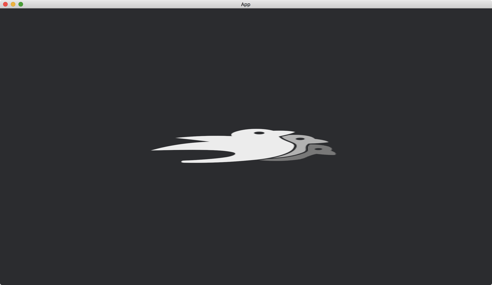

# Scale

Previously, we used [custom_size](https://docs.rs/bevy/latest/bevy/sprite/struct.Sprite.html#structfield.custom_size) of [Sprite](https://docs.rs/bevy/latest/bevy/sprite/struct.Sprite.html) to specify the size of an image.
The component is only useful when we know the exact size we are going to set.
For the sizes that are relative to the original size, we have to resize the image by [Transform](https://docs.rs/bevy/latest/bevy/transform/components/struct.Transform.html).

We use the function [Transform::from_scale](https://docs.rs/bevy/latest/bevy/transform/components/struct.Transform.html#method.from_scale) to resize an object based on its original size.

```rust
fn setup(mut commands: Commands, asset_server: Res<AssetServer>) {
    commands.spawn(Camera2dBundle::default());

    commands.spawn(SpriteBundle {
        texture: asset_server.load("bevy_bird_dark.png"),
        transform: Transform::from_scale((2.0, 0.5, 1.0).into()),
        ..default()
    });
}
```

The function [Transform::from_scale](https://docs.rs/bevy/latest/bevy/transform/components/struct.Transform.html#method.from_scale) takes a struct [Vec3](https://docs.rs/bevy/latest/bevy/math/f32/struct.Vec3.html) as a parameter, which specifies the scale factor for `x`, `y` and `z`-axis.

The full code is as follows:

```rust
use bevy::{
    app::{App, Startup},
    asset::AssetServer,
    core_pipeline::core_2d::Camera2dBundle,
    ecs::system::{Commands, Res},
    sprite::SpriteBundle,
    transform::components::Transform,
    utils::default,
    DefaultPlugins,
};

fn main() {
    App::new()
        .add_plugins(DefaultPlugins)
        .add_systems(Startup, setup)
        .run();
}

fn setup(mut commands: Commands, asset_server: Res<AssetServer>) {
    commands.spawn(Camera2dBundle::default());

    commands.spawn(SpriteBundle {
        texture: asset_server.load("bevy_bird_dark.png"),
        transform: Transform::from_scale((2.0, 0.5, 1.0).into()),
        ..default()
    });
}
```

Result:



<!-- :arrow_right:  Next:  -->

:blue_book: Back: [Table of contents](./../README.md)
