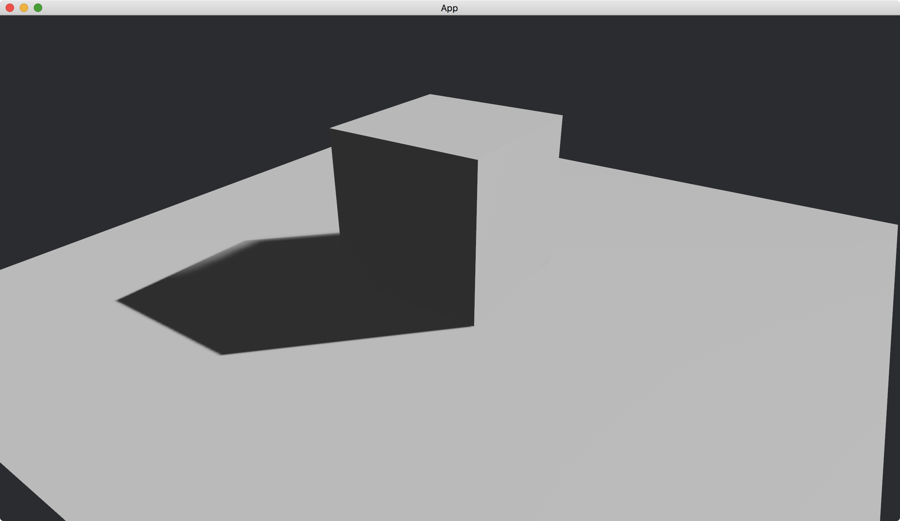

# Shadow

We can enable shadows for each kind of lights.

For directional light, we use [shadows_enabled](https://docs.rs/bevy/latest/bevy/pbr/struct.DirectionalLight.html#structfield.shadows_enabled) of [directional_light](https://docs.rs/bevy/latest/bevy/pbr/struct.DirectionalLightBundle.html#structfield.directional_light) of [DirectionalLightBundle](https://docs.rs/bevy/latest/bevy/pbr/struct.DirectionalLightBundle.html).

```rust
commands.spawn(DirectionalLightBundle {
    directional_light: DirectionalLight {
        shadows_enabled: true,
        ..default()
    },
    ..default()
});
```

For point light, we use [shadows_enabled](https://docs.rs/bevy/latest/bevy/pbr/struct.PointLight.html#structfield.shadows_enabled) of [point_light](https://docs.rs/bevy/latest/bevy/pbr/struct.PointLightBundle.html#structfield.point_light) of [PointLightBundle](https://docs.rs/bevy/latest/bevy/pbr/struct.PointLightBundle.html).

```rust
commands.spawn(PointLightBundle {
    point_light: PointLight {
        shadows_enabled: true,
        ..default()
    },
    ..default()
});
```

For spot light, we use [shadows_enabled](https://docs.rs/bevy/latest/bevy/pbr/struct.SpotLight.html#structfield.shadows_enabled) of [spot_light](https://docs.rs/bevy/latest/bevy/pbr/struct.SpotLightBundle.html#structfield.spot_light) of [SpotLightBundle](https://docs.rs/bevy/latest/bevy/pbr/struct.SpotLightBundle.html).

```rust
commands.spawn(SpotLightBundle {
    spot_light: SpotLight {
        shadows_enabled: true,
        ..default()
    },
    ..default()
});
```

In the following, we use directional light as an example.

```rust
use bevy::{
    app::{App, Startup},
    asset::Assets,
    core_pipeline::core_3d::Camera3dBundle,
    ecs::system::{Commands, ResMut},
    math::Vec3,
    pbr::{DirectionalLight, DirectionalLightBundle, PbrBundle, StandardMaterial},
    render::mesh::{
        shape::{Cube, Plane},
        Mesh,
    },
    transform::components::Transform,
    utils::default,
    DefaultPlugins,
};

fn main() {
    App::new()
        .add_plugins(DefaultPlugins)
        .add_systems(Startup, setup)
        .run();
}

fn setup(
    mut commands: Commands,
    mut meshes: ResMut<Assets<Mesh>>,
    mut materials: ResMut<Assets<StandardMaterial>>,
) {
    commands.spawn(Camera3dBundle {
        transform: Transform::from_xyz(2., 2., 3.).looking_at(Vec3::ZERO, Vec3::Y),
        ..default()
    });

    commands.spawn(PbrBundle {
        mesh: meshes.add(Cube::new(1.).into()).into(),
        transform: Transform::from_xyz(0., 0.5, 0.),
        material: materials.add(StandardMaterial::default()).into(),
        ..default()
    });

    commands.spawn(PbrBundle {
        mesh: meshes.add(Plane::from_size(5.).into()).into(),
        material: materials.add(StandardMaterial::default()).into(),
        ..default()
    });

    commands.spawn(DirectionalLightBundle {
        directional_light: DirectionalLight {
            illuminance: 20000.,
            shadows_enabled: true,
            ..default()
        },
        transform: Transform::default().looking_to(Vec3::new(-1., -1., 1.), Vec3::Y),
        ..default()
    });
}
```

Result:



:arrow_right:  Next: [Base Colors](./base_colors.md)

:blue_book: Back: [Table of contents](./../README.md)
