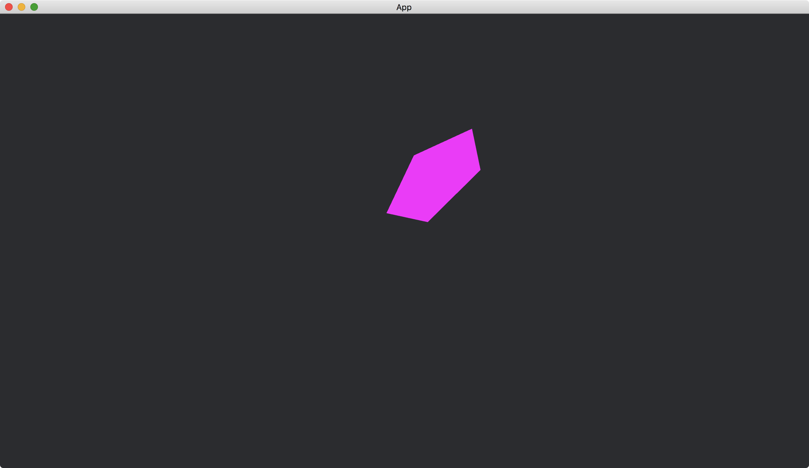

# Shapes With Transformation

All the shapes in [bevy::prelude::shape](https://docs.rs/bevy/latest/bevy/prelude/shape/index.html) can apply [Transform](https://docs.rs/bevy/latest/bevy/transform/components/struct.Transform.html) to change their positions, rotations and sizes.

We use [Transform](https://docs.rs/bevy/latest/bevy/transform/components/struct.Transform.html) in [ColorMesh2dBundle](https://docs.rs/bevy/latest/bevy/sprite/type.ColorMesh2dBundle.html) to do the transformation.

```rust
use bevy::{
    app::{App, Startup},
    asset::Assets,
    core_pipeline::core_2d::Camera2dBundle,
    ecs::system::{Commands, ResMut},
    math::Quat,
    prelude::default,
    render::mesh::{shape::RegularPolygon, Mesh},
    sprite::ColorMesh2dBundle,
    transform::components::Transform,
    DefaultPlugins,
};

fn main() {
    App::new()
        .add_plugins(DefaultPlugins)
        .add_systems(Startup, setup)
        .run();
}

fn setup(mut commands: Commands, mut meshes: ResMut<Assets<Mesh>>) {
    commands.spawn(Camera2dBundle::default());

    commands.spawn(ColorMesh2dBundle {
        mesh: meshes.add(RegularPolygon::new(50., 5).into()).into(),
        transform: Transform {
            translation: (50., 100., 0.).into(),
            rotation: Quat::from_rotation_z(0.78),
            scale: (2., 1., 1.).into(),
        },
        ..default()
    });
}
```

Result:



<!-- :arrow_right:  Next:  -->

:blue_book: Back: [Table of contents](./../README.md)
