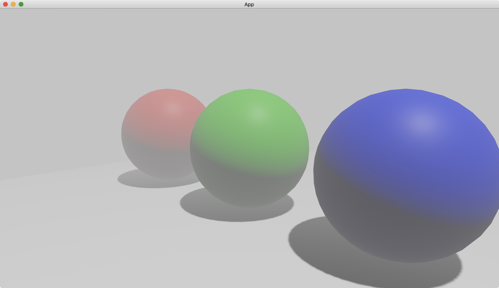

# Sky

Although we enable fog in the previous tutorial, the background is dark, which makes the scene odd.
To fix this, we can add an object that acts as the sky, and then we will have fog in the sky as well.

Our sky is a large enough sphere that contains all the other objects in the scene.

```rust
commands.spawn((
    PbrBundle {
        mesh: meshes.add(
            UVSphere {
                radius: 10.,
                ..default()
            }
            .into(),
        ),
        material: materials.add(StandardMaterial {
            cull_mode: None,
            ..default()
        }),
        ..default()
    },
    NotShadowCaster,
));
```

In most of cases, our camera is inside the large sphere.
So the camera must see the sphere from its inner side.
To do so, we set [cull_mode](https://docs.rs/bevy/latest/bevy/pbr/struct.StandardMaterial.html#structfield.cull_mode) in [StandardMaterial](https://docs.rs/bevy/latest/bevy/pbr/struct.StandardMaterial.html) to [None](https://doc.rust-lang.org/nightly/core/option/enum.Option.html#variant.None).

We also add the component [NotShadowCaster](https://docs.rs/bevy/latest/bevy/pbr/struct.NotShadowCaster.html), which is spawned together with the [PbrBundle](https://docs.rs/bevy/latest/bevy/pbr/type.PbrBundle.html) of the large sphere.
This ensures that the large sphere provides no shadows on the other objects.

The full code is as follows:

```rust
use bevy::{
    app::{App, Startup},
    asset::Assets,
    core_pipeline::core_3d::Camera3dBundle,
    ecs::system::{Commands, ResMut},
    math::Vec3,
    pbr::{
        DirectionalLight, DirectionalLightBundle, FogFalloff, FogSettings, NotShadowCaster,
        PbrBundle, StandardMaterial,
    },
    render::{
        color::Color,
        mesh::{
            shape::{Plane, UVSphere},
            Mesh,
        },
    },
    transform::components::Transform,
    utils::default,
    DefaultPlugins,
};

fn main() {
    App::new()
        .add_plugins(DefaultPlugins)
        .add_systems(Startup, setup)
        .run();
}

fn setup(
    mut commands: Commands,
    mut meshes: ResMut<Assets<Mesh>>,
    mut materials: ResMut<Assets<StandardMaterial>>,
) {
    commands.spawn((
        Camera3dBundle {
            transform: Transform::from_xyz(2., 1., 2.).looking_at(Vec3::new(0., 0.5, 0.), Vec3::Y),
            ..default()
        },
        FogSettings {
            color: Color::WHITE,
            falloff: FogFalloff::from_visibility_contrast_squared(0.5, 0.99),
            ..default()
        },
    ));

    // left
    commands.spawn(PbrBundle {
        mesh: meshes.add(
            UVSphere {
                radius: 0.5,
                ..default()
            }
            .into(),
        ),
        material: materials.add(StandardMaterial {
            base_color: Color::RED,
            ..default()
        }),
        transform: Transform::from_xyz(-1.25, 0.5, 0.),
        ..default()
    });

    // middle
    commands.spawn(PbrBundle {
        mesh: meshes.add(
            UVSphere {
                radius: 0.5,
                ..default()
            }
            .into(),
        ),
        material: materials.add(StandardMaterial {
            base_color: Color::GREEN,
            ..default()
        }),
        transform: Transform::from_xyz(0., 0.5, 0.),
        ..default()
    });

    // right
    commands.spawn(PbrBundle {
        mesh: meshes.add(
            UVSphere {
                radius: 0.5,
                ..default()
            }
            .into(),
        ),
        material: materials.add(StandardMaterial {
            base_color: Color::BLUE,
            ..default()
        }),
        transform: Transform::from_xyz(1.25, 0.5, 0.),
        ..default()
    });

    // ground
    commands.spawn(PbrBundle {
        mesh: meshes.add(Plane::from_size(5.).into()),
        material: materials.add(StandardMaterial::default()),
        ..default()
    });

    // sky
    commands.spawn((
        PbrBundle {
            mesh: meshes.add(
                UVSphere {
                    radius: 10.,
                    ..default()
                }
                .into(),
            ),
            material: materials.add(StandardMaterial {
                cull_mode: None,
                ..default()
            }),
            ..default()
        },
        NotShadowCaster,
    ));

    // light
    commands.spawn(DirectionalLightBundle {
        directional_light: DirectionalLight {
            illuminance: 20000.,
            shadows_enabled: true,
            ..default()
        },
        transform: Transform::default().looking_to(Vec3::new(-1., -3., 0.), Vec3::Y),
        ..default()
    });
}
```

Result:



:arrow_right:  Next: [Moonlight](./moonlight.md)

:blue_book: Back: [Table of contents](./../README.md)
