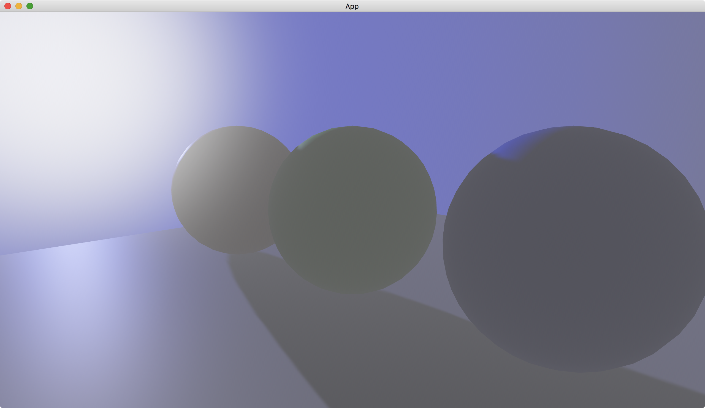

# Sunlight

For sunlight, we can use [FogFalloff::from_visibility_colors](https://docs.rs/bevy/latest/bevy/pbr/enum.FogFalloff.html#method.from_visibility_colors) together with [directional_light_color](https://docs.rs/bevy/latest/bevy/pbr/struct.FogSettings.html#structfield.directional_light_color) and [directional_light_exponent](https://docs.rs/bevy/latest/bevy/pbr/struct.FogSettings.html#structfield.directional_light_exponent) in [FogSettings](https://docs.rs/bevy/latest/bevy/pbr/struct.FogSettings.html).

```rust
commands.spawn((
    Camera3dBundle::default(),
    FogSettings {
        color: Color::rgb(0.5, 0.5, 0.5),
        falloff: FogFalloff::from_visibility_colors(10., Color::BLUE, Color::WHITE),
        directional_light_color: Color::WHITE,
        directional_light_exponent: 50.,
        ..default()
    },
));
```

The [from_visibility_colors](https://docs.rs/bevy/latest/bevy/pbr/enum.FogFalloff.html#method.from_visibility_colors) takes `visibility`, `extinction_color` and `inscattering_color` as its parameters.
The visibility parameter is a distance from the camera where objects in the range remain their materials.
The inscattering color parameter is the color of the sun.
The extinction color parameter is the color when the sun goes weak.

The [directional_light_color](https://docs.rs/bevy/latest/bevy/pbr/struct.FogSettings.html#structfield.directional_light_color) controls the brightness of the sun.
The [directional_light_exponent](https://docs.rs/bevy/latest/bevy/pbr/struct.FogSettings.html#structfield.directional_light_exponent) specifies the size of the sun.
The larger the value, the smaller the sun.

The [color](https://docs.rs/bevy/latest/bevy/pbr/struct.FogSettings.html#structfield.color) of [FogSettings](https://docs.rs/bevy/latest/bevy/pbr/struct.FogSettings.html) controls the diffusion of the sun.

The full code is as follows:

```rust
use bevy::{
    app::{App, Startup},
    asset::Assets,
    core_pipeline::core_3d::Camera3dBundle,
    ecs::system::{Commands, ResMut},
    math::Vec3,
    pbr::{
        DirectionalLight, DirectionalLightBundle, FogFalloff, FogSettings, NotShadowCaster,
        PbrBundle, StandardMaterial,
    },
    render::{
        color::Color,
        mesh::{
            shape::{Plane, UVSphere},
            Mesh,
        },
    },
    transform::components::Transform,
    utils::default,
    DefaultPlugins,
};

fn main() {
    App::new()
        .add_plugins(DefaultPlugins)
        .add_systems(Startup, setup)
        .run();
}

fn setup(
    mut commands: Commands,
    mut meshes: ResMut<Assets<Mesh>>,
    mut materials: ResMut<Assets<StandardMaterial>>,
) {
    commands.spawn((
        Camera3dBundle {
            transform: Transform::from_xyz(2., 1., 2.).looking_at(Vec3::new(0., 0.5, 0.), Vec3::Y),
            ..default()
        },
        FogSettings {
            color: Color::rgb(0.5, 0.5, 0.5),
            falloff: FogFalloff::from_visibility_colors(10., Color::BLUE, Color::WHITE),
            directional_light_color: Color::WHITE,
            directional_light_exponent: 50.,
            ..default()
        },
    ));

    // left
    commands.spawn(PbrBundle {
        mesh: meshes.add(
            UVSphere {
                radius: 0.5,
                ..default()
            }
            .into(),
        ),
        material: materials.add(StandardMaterial {
            base_color: Color::RED,
            ..default()
        }),
        transform: Transform::from_xyz(-1.25, 0.5, 0.),
        ..default()
    });

    // middle
    commands.spawn(PbrBundle {
        mesh: meshes.add(
            UVSphere {
                radius: 0.5,
                ..default()
            }
            .into(),
        ),
        material: materials.add(StandardMaterial {
            base_color: Color::GREEN,
            ..default()
        }),
        transform: Transform::from_xyz(0., 0.5, 0.),
        ..default()
    });

    // right
    commands.spawn(PbrBundle {
        mesh: meshes.add(
            UVSphere {
                radius: 0.5,
                ..default()
            }
            .into(),
        ),
        material: materials.add(StandardMaterial {
            base_color: Color::BLUE,
            ..default()
        }),
        transform: Transform::from_xyz(1.25, 0.5, 0.),
        ..default()
    });

    // ground
    commands.spawn(PbrBundle {
        mesh: meshes.add(Plane::from_size(5.).into()),
        material: materials.add(StandardMaterial::default()),
        ..default()
    });

    // sky
    commands.spawn((
        PbrBundle {
            mesh: meshes.add(
                UVSphere {
                    radius: 10.,
                    ..default()
                }
                .into(),
            ),
            material: materials.add(StandardMaterial {
                cull_mode: None,
                ..default()
            }),
            ..default()
        },
        NotShadowCaster,
    ));

    // light
    commands.spawn(DirectionalLightBundle {
        directional_light: DirectionalLight {
            illuminance: 20000.,
            shadows_enabled: true,
            ..default()
        },
        transform: Transform::default().looking_to(Vec3::new(2., -0.2, 0.5), Vec3::Y),
        ..default()
    });
}
```

Result:



<!-- :arrow_right:  Next:  -->

:blue_book: Back: [Table of contents](./../README.md)
