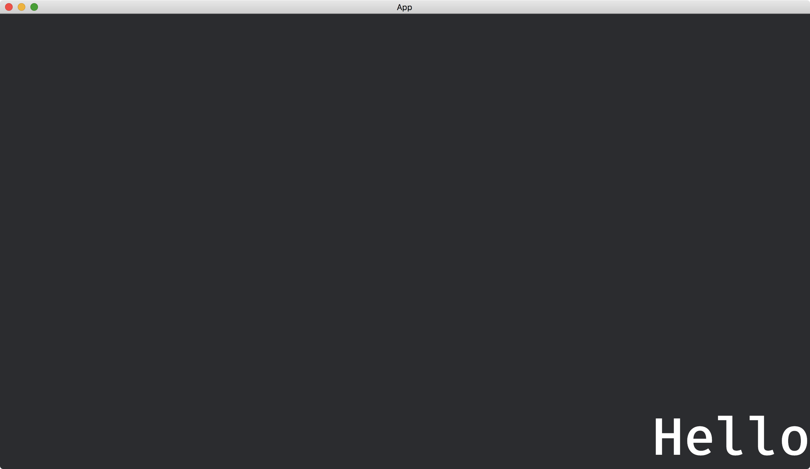

# Text Positions

When our app spawns a [Text2dBundle](https://docs.rs/bevy/latest/bevy/text/struct.Text2dBundle.html), its anchor point will be aligned to the specified location (default to the origin).
The anchor point can be changed by [Anchor](https://docs.rs/bevy/latest/bevy/sprite/enum.Anchor.html) of [Text2dBundle](https://docs.rs/bevy/latest/bevy/text/struct.Text2dBundle.html).

```rust
commands.spawn(Text2dBundle {
    text: Text::from_section(
        "Hello",
        TextStyle {
            font_size: 100.,
            ..default()
        },
    ),
    text_anchor: Anchor::BottomRight,
    ..default()
});
```

The full code is as follows:

```rust
use bevy::{
    app::{App, Startup},
    core_pipeline::core_2d::Camera2dBundle,
    ecs::system::Commands,
    sprite::Anchor,
    text::{Text, Text2dBundle, TextStyle},
    utils::default,
    DefaultPlugins,
};

fn main() {
    App::new()
        .add_plugins(DefaultPlugins)
        .add_systems(Startup, setup)
        .run();
}

fn setup(mut commands: Commands) {
    commands.spawn(Camera2dBundle::default());

    commands.spawn(Text2dBundle {
        text: Text::from_section(
            "Hello",
            TextStyle {
                font_size: 100.,
                ..default()
            },
        ),
        text_anchor: Anchor::BottomRight,
        ..default()
    });
}
```

Result:


Combine with the [Window](https://docs.rs/bevy/latest/bevy/window/struct.Window.html) component, we can place our text on the bottom-right corner of the window.

```rust
use bevy::{
    app::{App, Startup, Update},
    core_pipeline::core_2d::Camera2dBundle,
    ecs::{
        query::With,
        system::{Commands, Query},
    },
    sprite::Anchor,
    text::{Text, Text2dBundle, TextStyle},
    transform::components::Transform,
    utils::default,
    window::Window,
    DefaultPlugins,
};

fn main() {
    App::new()
        .add_plugins(DefaultPlugins)
        .add_systems(Startup, setup)
        .add_systems(Update, set_text_position)
        .run();
}

fn setup(mut commands: Commands) {
    commands.spawn(Camera2dBundle::default());

    commands.spawn(Text2dBundle {
        text: Text::from_section(
            "Hello",
            TextStyle {
                font_size: 100.,
                ..default()
            },
        ),
        text_anchor: Anchor::BottomRight,
        ..default()
    });
}

fn set_text_position(mut transforms: Query<&mut Transform, With<Text>>, windows: Query<&Window>) {
    let window = windows.single();

    let mut text_transform = transforms.single_mut();
    *text_transform = Transform::from_xyz(window.width() / 2., -window.height() / 2., 0.);
}
```

We use `*` to update the variable `text_transform` directly.
As the variable can be treated as a reference, we can use the `*` symbol to change the content the variable points to.

Result:



<!-- :arrow_right:  Next:  -->

:blue_book: Back: [Table of contents](./../README.md)
