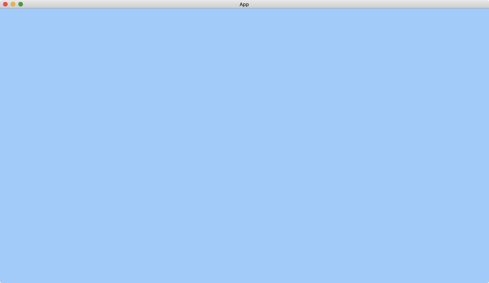

# The Background Color

The first thing we can do with [Camera2dBundle](https://docs.rs/bevy/latest/bevy/core_pipeline/core_2d/struct.Camera2dBundle.html) is to change the background color.

The [Camera2d](https://docs.rs/bevy/0.12.1/bevy/core_pipeline/core_2d/struct.Camera2d.html) component in [Camera2dBundle](https://docs.rs/bevy/latest/bevy/core_pipeline/core_2d/struct.Camera2dBundle.html) contains a [ClearColorConfig](https://docs.rs/bevy/latest/bevy/render/camera/enum.ClearColorConfig.html) component, which specifies the background color associated with the camera.

```rust
use bevy::{
    app::{App, Startup},
    core_pipeline::{
        clear_color::ClearColorConfig,
        core_2d::{Camera2d, Camera2dBundle},
    },
    ecs::system::Commands,
    render::color::Color,
    utils::default,
    DefaultPlugins,
};

fn main() {
    App::new()
        .add_plugins(DefaultPlugins)
        .add_systems(Startup, setup)
        .run();
}

fn setup(mut commands: Commands) {
    commands.spawn(Camera2dBundle {
        camera_2d: Camera2d {
            clear_color: ClearColorConfig::Custom(Color::hsl(210., 1., 0.8)),
        },
        ..default()
    });
}
```

Result:



When we use [Camera2dBundle::default()](https://docs.rs/bevy/latest/bevy/core_pipeline/core_2d/struct.Camera2dBundle.html#method.default), the camera consults a resource [ClearColor](https://docs.rs/bevy/latest/bevy/render/camera/struct.ClearColor.html) for the background color.
Therefore, we can also replace the resource [ClearColor](https://docs.rs/bevy/latest/bevy/render/camera/struct.ClearColor.html) for changing the background color.

```rust
use bevy::{
    app::{App, Startup},
    core_pipeline::{clear_color::ClearColor, core_2d::Camera2dBundle},
    ecs::system::Commands,
    render::color::Color,
    DefaultPlugins,
};

fn main() {
    App::new()
        .add_plugins(DefaultPlugins)
        .add_systems(Startup, setup)
        .insert_resource(ClearColor(Color::hsl(210., 1., 0.8)))
        .run();
}

fn setup(mut commands: Commands) {
    commands.spawn(Camera2dBundle::default());
}
```

The code produces the same result.

:arrow_right:  Next: [Displaying Images](./displaying_images.md)

:blue_book: Back: [Table of contents](./../README.md)
