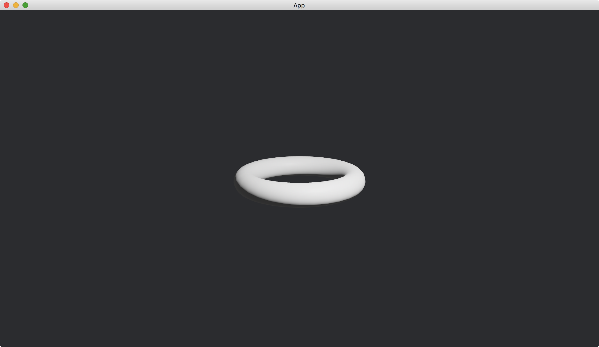

# Torus

A [Torus](https://docs.rs/bevy/latest/bevy/prelude/shape/struct.Torus.html) is a donut-like shape.

```rust
commands.spawn(PbrBundle {
    mesh: meshes
        .add(
            Torus {
                radius: 0.5,
                ring_radius: 0.1,
                ..default()
            }
            .into(),
        )
        .into(),
    ..default()
});
```

We can set the [radius](https://docs.rs/bevy/latest/bevy/prelude/shape/struct.Torus.html#structfield.radius) of the [Torus](https://docs.rs/bevy/latest/bevy/prelude/shape/struct.Torus.html) and the radius ([ring_radius](https://docs.rs/bevy/latest/bevy/prelude/shape/struct.Torus.html#structfield.ring_radius)) of the [Torus](https://docs.rs/bevy/latest/bevy/prelude/shape/struct.Torus.html)'s ring.

We set our camera position to `(2, 1, 3)` and make it looking at the origin.

The full code is as follows:

```rust
use bevy::{
    app::{App, Startup},
    asset::Assets,
    core_pipeline::core_3d::Camera3dBundle,
    ecs::system::{Commands, ResMut},
    math::Vec3,
    pbr::{PbrBundle, PointLightBundle, StandardMaterial},
    render::mesh::{shape::Torus, Mesh},
    transform::components::Transform,
    utils::default,
    DefaultPlugins,
};

fn main() {
    App::new()
        .add_plugins(DefaultPlugins)
        .add_systems(Startup, setup)
        .run();
}

fn setup(
    mut commands: Commands,
    mut meshes: ResMut<Assets<Mesh>>,
    mut materials: ResMut<Assets<StandardMaterial>>,
) {
    commands.spawn(Camera3dBundle {
        transform: Transform::from_xyz(2., 1., 3.).looking_at(Vec3::ZERO, Vec3::Y),
        ..default()
    });

    commands.spawn(PbrBundle {
        mesh: meshes
            .add(
                Torus {
                    radius: 0.5,
                    ring_radius: 0.1,
                    ..default()
                }
                .into(),
            )
            .into(),
        material: materials.add(StandardMaterial::default()).into(),
        ..default()
    });

    commands.spawn(PointLightBundle {
        transform: Transform::from_xyz(2., 2., 1.),
        ..default()
    });
}
```

Result:



<!-- :arrow_right:  Next:  -->

:blue_book: Back: [Table of contents](./../README.md)
