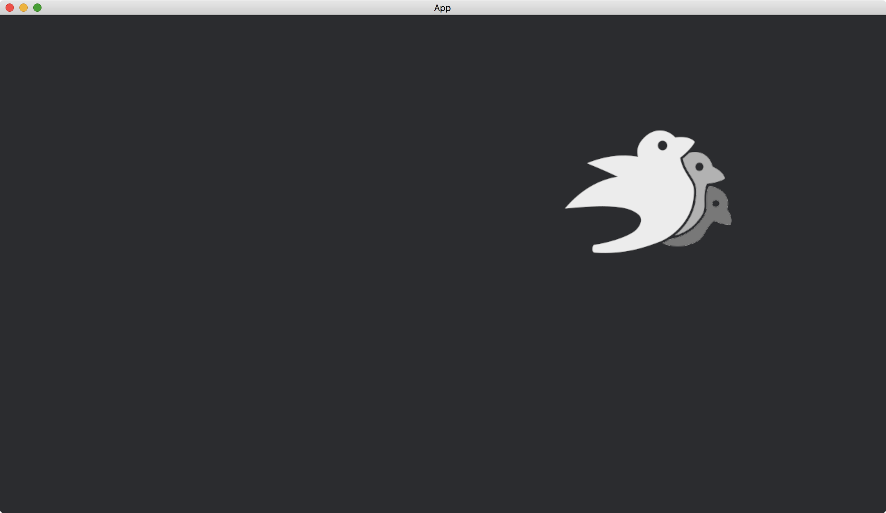

# Translation

The [Image](https://docs.rs/bevy/latest/bevy/render/texture/struct.Image.html) will be placed at the center of the window in default, which is the origin of the camera.
We can move the [Image](https://docs.rs/bevy/latest/bevy/render/texture/struct.Image.html) to other places by the [Transform](https://docs.rs/bevy/latest/bevy/transform/components/struct.Transform.html) of the [SpriteBundle](https://docs.rs/bevy/latest/bevy/sprite/struct.SpriteBundle.html) that possesses the [Image](https://docs.rs/bevy/latest/bevy/render/texture/struct.Image.html).

```rust
fn setup(mut commands: Commands, asset_server: Res<AssetServer>) {
    commands.spawn(Camera2dBundle::default());

    commands.spawn(SpriteBundle {
        texture: asset_server.load("bevy_bird_dark.png"),
        transform: Transform::from_xyz(300., 100., 0.),
        ..default()
    });
}
```

The function [Transform::from_xyz](https://docs.rs/bevy/latest/bevy/transform/components/struct.Transform.html#method.from_xyz) takes three parameters `x`, `y` and `z`.
Positive `x` moves the sprite to the right and positive `y` moves the sprite to the top.
In [Camera2dBundle](https://docs.rs/bevy/latest/bevy/core_pipeline/core_2d/struct.Camera2dBundle.html), `z` is for the drawing order of images and other 2-dimensional objects.
Objects with larger `z` will be drawn on top of objects with smaller `z`.

The full code is as follows:

```rust
use bevy::{
    app::{App, Startup},
    asset::AssetServer,
    core_pipeline::core_2d::Camera2dBundle,
    ecs::system::{Commands, Res},
    sprite::SpriteBundle,
    transform::components::Transform,
    utils::default,
    DefaultPlugins,
};

fn main() {
    App::new()
        .add_plugins(DefaultPlugins)
        .add_systems(Startup, setup)
        .run();
}

fn setup(mut commands: Commands, asset_server: Res<AssetServer>) {
    commands.spawn(Camera2dBundle::default());

    commands.spawn(SpriteBundle {
        texture: asset_server.load("bevy_bird_dark.png"),
        transform: Transform::from_xyz(300., 100., 0.),
        ..default()
    });
}
```

Result:



:arrow_right:  Next: [Rotation](./rotation.md)

:blue_book: Back: [Table of contents](./../README.md)
